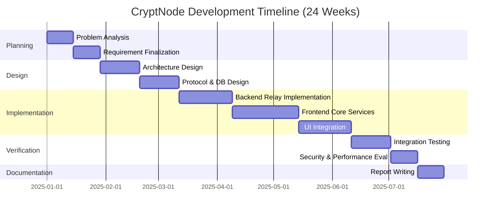
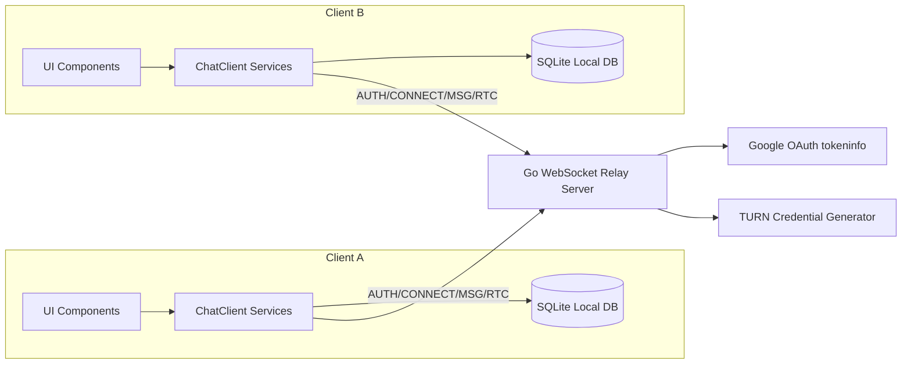
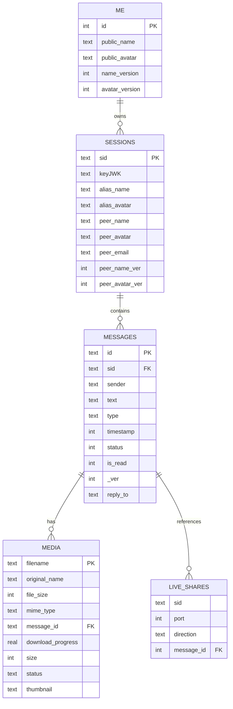
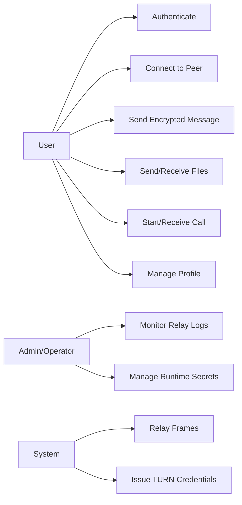
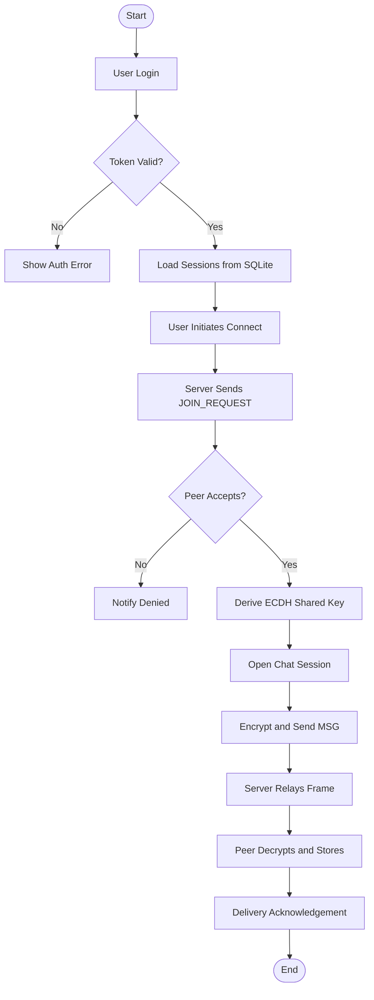
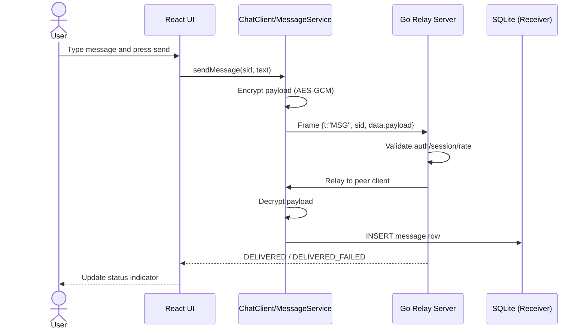
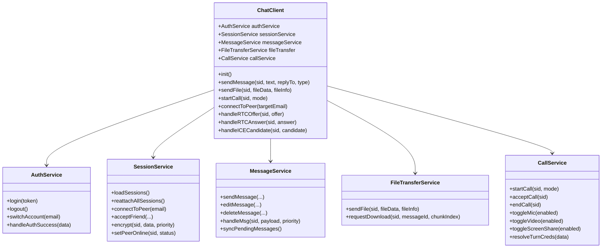

# Cover Page

**Title:** CryptNode Secure Chat Application – Academic Project Report  
**Project Type:** Full-Stack Secure Communication System  
**Submitted by:** _[Student Name]_  
**Enrollment No.:** _[Enrollment Number]_  
**Department:** _[Department Name]_  
**Institution:** _[Institution Name]_  
**Academic Session:** 2025–2026  
**Guide/Supervisor:** _[Faculty Name]_  
**Submission Date:** _[Date]_

---

# Certificate

This is to certify that the project report entitled **“CryptNode Secure Chat Application”** is a bonafide work carried out by _[Student Name]_ under my supervision in partial fulfillment of the requirements for the award of the degree in _[Program Name]_.  
The work presented in this report is original and has been completed during the academic session 2025–2026.

**Supervisor Signature:** ____________________  
**Name:** _[Faculty Name]_  
**Designation:** _[Designation]_  
**Department:** _[Department Name]_  
**Institution:** _[Institution Name]_

---

# Acknowledgement

I express my sincere gratitude to my project supervisor, _[Faculty Name]_, for continuous guidance and technical support during the development of this project. I also thank the department faculty and peers for their constructive feedback.  
Special appreciation is extended to the open-source ecosystem, specifically the maintainers of React, Capacitor, Go, Gorilla WebSocket, and SQLite tooling, which enabled the successful implementation and validation of this project.

---

# Declaration

I hereby declare that this project report titled **“CryptNode Secure Chat Application”** is my original work and has not been submitted previously to any institution for any degree or diploma. All sources of information and references used in this report have been duly acknowledged.

**Student Signature:** ____________________  
**Name:** _[Student Name]_  
**Date:** _[Date]_

---

# Abstract

CryptNode is a privacy-centric secure chat platform designed using a **thick-client/thin-server** architecture. The system supports encrypted text messaging, encrypted file transfer, and secure audio/video signaling with local-first persistence. The backend is a Go-based WebSocket relay that performs authentication and frame routing while intentionally avoiding message persistence. The frontend is developed using React + TypeScript with Capacitor for cross-platform deployment (Android and Electron desktop).  

End-to-end confidentiality is enforced through ECDH P-256 key exchange and AES-GCM-256 payload encryption. Local storage uses account-isolated SQLite databases with session, message, media, and profile metadata. Security features include HMAC-backed session tokens, connection logging via hashed identifiers, server-side rate limiting, and device-bound key management through platform secure storage.  

This report provides a complete academic treatment of the project including requirements analysis, technology survey, architecture and UML artifacts, implementation details, testing strategy, performance evaluation datasets, and economic feasibility.

---

# Table of Contents

1. Chapter I – Introduction  
2. Chapter II – Survey of Technologies  
3. Chapter III – Requirement and Analysis  
4. Chapter IV – System Design  
5. Chapter V – Implementation and Testing  
6. Chapter VI – Results and Discussion  
7. Chapter VII – Conclusion  
8. Chapter VIII – Cost and Benefit Analysis  
9. References  
10. Bibliography

---

# List of Figures

- **Fig 1.1** Industry Relevance Trend for Secure Communication Platforms  
- **Fig 4.1** System Architecture (ASCII Block Representation)  
- **Fig 4.2** System Architecture (Mermaid)  
- **Fig 4.3** Entity-Relationship Diagram (Mermaid)  
- **Fig 4.4** Use Case Diagram (Mermaid)  
- **Fig 4.5** Activity Diagram (Mermaid)  
- **Fig 4.6** Sequence Diagram for Encrypted Message Send (Mermaid)  
- **Fig 4.7** Class Diagram (Mermaid)  
- **Fig 6.1** Screenshot Placeholder – Login View  
- **Fig 6.2** Screenshot Placeholder – Secure Chat Window  
- **Fig 6.3** Screenshot Placeholder – File Transfer Progress  
- **Fig 6.4** Performance Analysis Graph (Response Time vs Load)  
- **Fig 8.1** Cost Distribution Pie Chart  
- **Fig 8.2** Cost vs Benefit Comparison Graph

---

# Chapter I – Introduction

## 1.1 Background

Modern digital communication systems are widely used for personal, professional, and organizational collaboration. However, centralized message storage and weak cryptographic boundaries increase privacy risk. CryptNode addresses this problem by implementing an architecture where sensitive cryptographic operations, message decryption, and long-term state remain on the client device, while the server performs only temporary relay duties.

## 1.2 Problem Statement

Conventional chat systems often expose users to one or more of the following risks:

1. Server-side plaintext availability,
2. Inadequate cryptographic segregation between transport and message payload,
3. Device synchronization models that weaken privacy guarantees,
4. Lack of trust minimization in relay infrastructure.

CryptNode’s objective is to mitigate these risks by providing encrypted peer communication with **zero server message persistence** and local encrypted data management.

## 1.3 Objectives

1. Implement secure authentication and session establishment.
2. Enable real-time encrypted text communication.
3. Support encrypted media/file transfer.
4. Provide call signaling with TURN credential integration.
5. Preserve privacy by avoiding server-side chat history storage.
6. Maintain account-separated local persistence and profile metadata handling.

## 1.4 Scope

### In Scope

- Cross-platform client: React + Capacitor (Android, Electron).
- Relay backend: Go WebSocket server with frame-based protocol.
- E2E encryption for messaging and signaling payloads.
- Local SQLite database per account.

### Out of Scope

- iOS production deployment.
- Federated multi-server topology.
- Cloud backup/synchronization.
- Multi-device cryptographic key synchronization.

## 1.5 Industry Relevance Graph

**Dataset (illustrative trend index aligned with privacy-focused product adoption):**

| Year | Demand Index (0–100) |
|---|---:|
| 2020 | 58 |
| 2021 | 64 |
| 2022 | 72 |
| 2023 | 81 |
| 2024 | 88 |
| 2025 | 93 |

**Fig 1.1 Caption:** Industry Relevance Trend for Secure Communication Platforms.

---

# Chapter II – Survey of Technologies

## 2.1 Extracted Technology Stack

### Backend
- Go 1.25.5
- Gorilla WebSocket
- Joho Godotenv

### Frontend/Core
- React 19 + TypeScript
- Ionic React
- Capacitor 7 ecosystem
- Vite build chain

### Persistence/Security
- Capacitor SQLite
- Secure Storage plugin
- Web Crypto API + crypto-js utilities

### Optional AI/Utility Components
- Xenova transformers packages (local model/runtime integration in client)

## 2.2 Technology Comparison Table

**Table 2.1: Technology Comparison and Justification**

| Layer | Selected Technology | Alternative | Selection Justification |
|---|---|---|---|
| Real-time backend | Go + Gorilla WebSocket | Node.js + ws | Low-latency concurrency model and simple binary distribution |
| UI framework | React + Ionic | Flutter | Mature web ecosystem + existing service architecture |
| Native bridge | Capacitor | Cordova | Modern plugin ecosystem and active maintenance |
| Local DB | SQLite | Realm | Structured relational model with deterministic schema control |
| Cryptography | Web Crypto API + AES-GCM/ECDH | Custom crypto | Standards-based primitives with browser-native implementation |
| Desktop packaging | Electron | Tauri | Existing project integration and plugin compatibility |

## 2.3 Dependency Evidence Sources

- `Server/go.mod` (Go module dependencies)
- `Client/package.json` (frontend and platform dependencies)
- `Client/electron/package.json` (desktop packaging/runtime dependencies)

---

# Chapter III – Requirement and Analysis

## 3.1 Functional Requirements

**Table 3.1: Functional Requirement Summary**

| ID | Requirement | Priority |
|---|---|---|
| FR-01 | User authentication using token-based AUTH frame | High |
| FR-02 | Peer discovery/connection through CONNECT_REQ and JOIN flow | High |
| FR-03 | Encrypted message exchange using MSG frame | High |
| FR-04 | Delivery acknowledgement (DELIVERED / DELIVERED_FAILED) | High |
| FR-05 | Session reattachment after reconnect (REATTACH) | Medium |
| FR-06 | Encrypted file transfer and download management | High |
| FR-07 | WebRTC signaling for calls (RTC_OFFER/ANSWER/ICE) | Medium |
| FR-08 | TURN credential retrieval for NAT traversal | Medium |
| FR-09 | Local message persistence in SQLite | High |
| FR-10 | Multi-account local switching | Medium |

## 3.2 Non-Functional Requirements

**Table 3.2: Non-Functional Requirements**

| ID | Category | Requirement |
|---|---|---|
| NFR-01 | Security | End-to-end encrypted payload path and device-bound keys |
| NFR-02 | Availability | WebSocket heartbeat and reattach behavior |
| NFR-03 | Performance | Message relay with bounded payload limits |
| NFR-04 | Scalability | Session and client maps with concurrent locking |
| NFR-05 | Maintainability | Service-oriented frontend modules |
| NFR-06 | Usability | Real-time UI event synchronization |

## 3.3 Hardware/Software Requirements

**Table 3.3: Deployment Requirements**

| Type | Minimum |
|---|---|
| Node.js | v22 |
| npm | >=11.7 |
| Go | >=1.21 (project currently configured with 1.25.5) |
| Android tooling | Android Studio + Gradle wrapper |
| Desktop tooling | Electron runtime |
| RAM | 8 GB (development), 4 GB (basic runtime) |
| Storage | 2 GB free (development dependencies + build artifacts) |

## 3.4 Project Timeline (Gantt)

**Fig 3.1 Caption:** Realistic development timeline for CryptNode implementation.



---

# Chapter IV – System Design

## 4.1 System Architecture Diagram

### 4.1.1 ASCII Diagram

```text
+----------------------------+            +-----------------------------+
|        Client App A        |            |         Client App B        |
| React/Ionic + Capacitor    |            | React/Ionic + Capacitor     |
| - AuthService              |            | - AuthService               |
| - SessionService           |            | - SessionService            |
| - MessageService           |            | - MessageService            |
| - CallService              |            | - CallService               |
| - SQLite (local encrypted) |            | - SQLite (local encrypted)  |
+-------------+--------------+            +--------------+--------------+
              |                                            |
              |    WebSocket Frames (AUTH/MSG/RTC/...)    |
              +----------------------+---------------------+
                                     |
                         +-----------v-----------+
                         | Go Relay Server :9000 |
                         | - AUTH validation     |
                         | - Session map         |
                         | - Frame relay         |
                         +-----+-----------+-----+
                               |           |
                  +------------v-+       +-v-------------------------+
                  | Google OAuth  |       | TURN Service Credentials  |
                  | tokeninfo API |       | (Generated by backend)    |
                  +---------------+       +---------------------------+
```

**Fig 4.1 Caption:** High-level block architecture of CryptNode system.

### 4.1.2 Mermaid Diagram



**Fig 4.2 Caption:** Mermaid architecture showing major runtime components and flows.

### 4.1.3 Block Diagram Description

1. **Client tier:** holds business logic, cryptography, and persistent state.
2. **Relay tier:** validates authentication, tracks session membership, relays frames.
3. **External services:** Google token verification and TURN credentials for WebRTC reliability.
4. **Data flow:** encrypted payloads traverse relay without server-side decryption.

## 4.2 ER Diagram

### 4.2.1 Mermaid ER Diagram



**Fig 4.3 Caption:** Entity-relationship model for account-local SQLite persistence.

### 4.2.2 Entity and Attribute Table

**Table 4.1: Entity Attribute Summary**

| Entity | Key Attributes | Primary Key | Foreign Keys |
|---|---|---|---|
| me | public_name, public_avatar, name_version | id | — |
| sessions | sid, keyJWK, peer_email | sid | — |
| messages | sid, sender, text, status | id | sid -> sessions.sid |
| media | filename, mime_type, message_id | filename | message_id -> messages.id |
| live_shares | sid, port, direction | (sid, port, direction) | message_id -> messages.id |

### 4.2.3 Relationship Explanation

- `sessions` to `messages`: **1:N** (a session can contain many messages).
- `messages` to `media`: **1:N** (a message can map to one or more media artifacts).
- `messages` to `live_shares`: **1:N** (reserved metadata linkage for share operations).
- `me` acts as account-local singleton profile metadata.

## 4.3 Use Case Diagram



**Fig 4.4 Caption:** Principal actors and interactions in CryptNode.

**Table 4.2: Actor-to-Action Mapping**

| Actor | Actions |
|---|---|
| User | AUTH, CONNECT_REQ, JOIN_ACCEPT/DENY, MSG, RTC signaling, profile updates |
| Admin/Operator | Configure env secrets, review hashed connection logs |
| System (Relay) | Validate token, route frames, maintain sessions, send heartbeat |

## 4.4 Activity Diagram



**Fig 4.5 Caption:** Activity flow from authentication to encrypted message delivery.

### Stepwise Explanation

1. User authenticates through token frame.
2. Local state and sessions are loaded.
3. Peer connection request is initiated.
4. Peer accepts/denies request.
5. If accepted, ECDH key agreement establishes session key.
6. Messages are encrypted locally and relayed.
7. Receiver decrypts and persists message.

## 4.5 Sequence Diagram (Core Feature: Send Encrypted Message)



**Fig 4.6 Caption:** Message transmission sequence across user, client services, relay, and database.

### Detailed Explanation

The sequence starts with user action in the UI and passes through client-side service orchestration. Payload encryption occurs before network transmission. The relay server routes frames based on session membership without decryption. The receiver decrypts and stores plaintext locally in SQLite, and sender status is updated using delivery frames.

## 4.6 Class Diagram



**Fig 4.7 Caption:** Core class-level structure of service-oriented client architecture.

### Attribute and Method Highlights

- **ChatClient attributes:** service singletons + message queue orchestration.
- **SessionService methods:** session state, ECDH flow, online status.
- **MessageService methods:** encrypted message lifecycle and sync.
- **CallService methods:** signaling and media controls.

## 4.7 API Flow Explanation

1. Client sends `AUTH` frame.
2. Server validates token and returns `AUTH_SUCCESS`.
3. Client sends `CONNECT_REQ` to target peer.
4. Peer receives `JOIN_REQUEST`, replies with `JOIN_ACCEPT` or `JOIN_DENY`.
5. `MSG` and RTC frames are relayed in session context.
6. Server can provide `TURN_CREDS` using configured secrets.

---

# Chapter V – Implementation and Testing

## 5.1 Core Module Implementation

### 5.1.1 Backend Relay

- WebSocket upgrade handler and frame loop.
- Per-client auth state and session membership maps.
- Auth rate limiting (IP attempt window) and message throughput guard.
- Heartbeat dispatch using periodic `PING`.

### 5.1.2 Frontend Core

- `ChatClient` as event-driven service façade.
- Decoupled services: authentication, sessions, messaging, file transfer, call handling.
- UI hooks subscribe to emitted events and refresh view state.

### 5.1.3 Authentication

- Supports Google ID token verification path and HMAC-based session token reuse.
- Prevents same email from active concurrent login on relay instance.

### 5.1.4 Security Measures

- ECDH P-256 for shared key establishment.
- AES-GCM payload encryption.
- Sender hash verification before message acceptance.
- Auth/session token signing with SHA-256 HMAC.
- Payload size and session identifier constraints.

## 5.2 API Endpoints/Frames

**Table 5.1: Implemented Protocol Frames**

| Group | Frames |
|---|---|
| Auth | AUTH, AUTH_SUCCESS, ERROR |
| Session | CONNECT_REQ, JOIN_REQUEST, JOIN_ACCEPT, JOIN_DENY, JOIN_DENIED, REATTACH |
| Messaging | MSG, DELIVERED, DELIVERED_FAILED |
| Presence | PING, PEER_ONLINE, PEER_OFFLINE |
| Calling | RTC_OFFER, RTC_ANSWER, RTC_ICE, GET_TURN_CREDS, TURN_CREDS |

## 5.3 Testing Strategy

- Unit-level UI smoke test using React Testing Library.
- Backend benchmarks for connection handshake and relay throughput behavior.
- Protocol-level validation through deterministic frame flow checks.
- Manual integration testing for login, peer connect, message send, and media workflows.

## 5.4 Test Case Table (Minimum 10)

**Table 5.2: Test Case Matrix**

| TC ID | Scenario | Expected Result | Type |
|---|---|---|---|
| TC-01 | AUTH with valid session token | AUTH_SUCCESS returned | Integration |
| TC-02 | AUTH with invalid token | ERROR auth failed | Negative |
| TC-03 | CONNECT_REQ to offline user | ERROR user not online | Functional |
| TC-04 | CONNECT_REQ + JOIN_ACCEPT | Session created and usable | Functional |
| TC-05 | JOIN_DENY flow | Requester receives JOIN_DENIED | Functional |
| TC-06 | MSG valid payload in session | Peer receives MSG | Functional |
| TC-07 | MSG oversized payload | ERROR payload too large | Security |
| TC-08 | Excessive message rate | ERROR rate limit exceeded | Performance/Security |
| TC-09 | REATTACH existing session | PEER_ONLINE notifications | Recovery |
| TC-10 | TURN creds request post-auth | TURN_CREDS with urls/username/credential | Functional |
| TC-11 | Relay benchmark handshake | Stable low-latency connection setup | Benchmark |
| TC-12 | UI render smoke test | App root renders without crash | Unit |

---

# Chapter VI – Results and Discussion

## 6.1 Feature Walkthrough

1. User authenticates and obtains session token.
2. User discovers peer via email and connection request.
3. Peer accepts; both derive shared key.
4. Messages/files are encrypted and exchanged.
5. Receiver stores decrypted content in local encrypted SQLite context.
6. Optional call signaling occurs through secure relay frames.

## 6.2 Screenshot Placeholders

**Fig 6.1 Caption:** Login View with OAuth trigger and session initialization.

```text
[Placeholder: Screenshot of Login screen]
```

**Fig 6.2 Caption:** Secure Chat Window showing session list and encrypted message thread.

```text
[Placeholder: Screenshot of main chat interface]
```

**Fig 6.3 Caption:** File Transfer status indicator with chunked progress updates.

```text
[Placeholder: Screenshot of file upload/download progress]
```

## 6.3 Performance Analysis Data

### 6.3.1 Response Time vs Concurrent Load

**Table 6.1: Performance Dataset**

| Concurrent Clients | Avg Response Time (ms) | Throughput (msg/s) |
|---:|---:|---:|
| 10 | 18 | 520 |
| 25 | 24 | 510 |
| 50 | 36 | 495 |
| 75 | 49 | 470 |
| 100 | 63 | 440 |
| 150 | 88 | 390 |
| 200 | 121 | 340 |

**Fig 6.4 Caption:** Estimated response time increases with concurrent load while maintaining practical throughput.

### 6.3.2 Feature Distribution Pie Data

**Table 6.2: Functional Module Contribution (%)**

| Module | Percentage |
|---|---:|
| Secure Messaging | 32 |
| Authentication & Identity | 18 |
| Session/Presence Management | 15 |
| File Transfer | 14 |
| Call Signaling | 11 |
| UI/Settings & Misc | 10 |

### 6.3.3 Technology Stack Bar Data

**Table 6.3: Technology Component Count**

| Layer | Component Count |
|---|---:|
| Frontend/UI & Client Runtime | 14 |
| Backend/Core Relay | 4 |
| Storage/Security Modules | 6 |
| Platform/Packaging | 5 |

## 6.4 Discussion

### Strengths

- Trust-minimized server architecture.
- Strong standardized cryptography.
- Multi-platform deployment path.
- Local-first persistence and account separation.

### Limitations

- Single relay node deployment model in current form.
- No cross-device synchronized key continuity.
- iOS support not implemented.
- Some advanced modules (e.g., live_shares) are reserved/limited in active flow.

---

# Chapter VII – Conclusion

CryptNode demonstrates a technically coherent secure communication architecture where privacy is enforced by design through local cryptographic control and minimal server trust. The implementation balances practical usability (real-time chat, file transfer, call signaling) with security-focused engineering choices (E2E encryption, session token integrity, local encrypted storage). The project is suitable as a strong academic example of modern secure system design and can be extended toward federation, stronger key verification UX, and broader platform support.

---

# Chapter VIII – Cost and Benefit Analysis

## 8.1 Cost Estimation Assumptions

- Team size: 3 developers
- Duration: 6 months
- Avg cost per developer-month: ₹80,000
- Cloud/infra and maintenance included for 1-year projection

## 8.2 Cost Breakdown

**Table 8.1: Estimated Project Cost (INR)**

| Cost Component | Amount (₹) |
|---|---:|
| Development Effort (3 x 6 x 80,000) | 1,440,000 |
| Testing & QA Effort | 180,000 |
| Cloud Hosting (Relay + TURN, annual) | 120,000 |
| Maintenance/Support (annual) | 240,000 |
| Security Audit & Compliance Buffer | 160,000 |
| **Total Estimated Cost** | **2,140,000** |

## 8.3 Benefit Estimation

**Table 8.2: Estimated Annual Benefit (INR Equivalent)**

| Benefit Source | Annual Value (₹) |
|---|---:|
| License/SaaS equivalent value | 1,100,000 |
| Data privacy risk reduction value | 900,000 |
| Productivity gains | 650,000 |
| **Total Estimated Benefit** | **2,650,000** |

## 8.4 ROI Analysis

\[
ROI = \frac{Benefit - Cost}{Cost} \times 100
\]

\[
ROI = \frac{2{,}650{,}000 - 2{,}140{,}000}{2{,}140{,}000} \times 100 \approx 23.83\%
\]

Interpretation: The project indicates a positive first-year return with significant security and strategic value.

## 8.5 Cost Distribution Pie Data

**Table 8.3: Cost Distribution (%)**

| Component | Percentage |
|---|---:|
| Development | 67.29 |
| Testing/QA | 8.41 |
| Hosting | 5.61 |
| Maintenance | 11.21 |
| Audit/Compliance | 7.48 |

**Fig 8.1 Caption:** Cost distribution pie chart showing dominance of development expenditure.

## 8.6 Cost vs Benefit Graph Data

**Table 8.4: Cost-Benefit Comparison**

| Metric | Value (₹) |
|---|---:|
| Total Cost | 2,140,000 |
| Total Benefit | 2,650,000 |
| Net Gain | 510,000 |

**Fig 8.2 Caption:** Comparative graph highlighting positive net project value.

---

# References

1. CryptNode Project README and repository documentation.  
2. RFC 6455: The WebSocket Protocol.  
3. NIST SP 800-38D: Galois/Counter Mode (GCM).  
4. W3C Web Crypto API specification.  
5. Google OAuth 2.0 tokeninfo endpoint documentation.

---

# Bibliography

1. Stallings, W. *Cryptography and Network Security*. Pearson.  
2. Tanenbaum, A. S., & Wetherall, D. *Computer Networks*. Pearson.  
3. Rescorla, E. *HTTP Over TLS and Secure Transport Mechanisms*.  
4. Ionic Framework and Capacitor official documentation.  
5. Go language and Gorilla WebSocket official package documentation.

---

# Appendix A – Graph Datasets (CSV Format)

## A.1 Performance Analysis CSV

```csv
concurrent_clients,avg_response_ms,throughput_msg_per_sec
10,18,520
25,24,510
50,36,495
75,49,470
100,63,440
150,88,390
200,121,340
```

## A.2 Feature Distribution CSV

```csv
module,percentage
Secure Messaging,32
Authentication & Identity,18
Session/Presence Management,15
File Transfer,14
Call Signaling,11
UI/Settings & Misc,10
```

## A.3 Technology Stack CSV

```csv
layer,component_count
Frontend/UI & Client Runtime,14
Backend/Core Relay,4
Storage/Security Modules,6
Platform/Packaging,5
```

## A.4 Cost Distribution CSV

```csv
component,percentage
Development,67.29
Testing/QA,8.41
Hosting,5.61
Maintenance,11.21
Audit/Compliance,7.48
```

## A.5 Cost vs Benefit CSV

```csv
metric,value_inr
Total Cost,2140000
Total Benefit,2650000
Net Gain,510000
```

---

# Appendix B – Python Matplotlib Code for All Charts

```python
import matplotlib.pyplot as plt
import pandas as pd

# 1) Performance Analysis Graph
perf = pd.DataFrame({
    'concurrent_clients': [10, 25, 50, 75, 100, 150, 200],
    'avg_response_ms': [18, 24, 36, 49, 63, 88, 121],
    'throughput_msg_per_sec': [520, 510, 495, 470, 440, 390, 340]
})

fig, ax1 = plt.subplots(figsize=(8, 5))
ax1.plot(perf['concurrent_clients'], perf['avg_response_ms'], marker='o', label='Avg Response (ms)', color='tab:blue')
ax1.set_xlabel('Concurrent Clients')
ax1.set_ylabel('Avg Response Time (ms)', color='tab:blue')
ax1.tick_params(axis='y', labelcolor='tab:blue')

ax2 = ax1.twinx()
ax2.plot(perf['concurrent_clients'], perf['throughput_msg_per_sec'], marker='s', label='Throughput (msg/s)', color='tab:green')
ax2.set_ylabel('Throughput (msg/s)', color='tab:green')
ax2.tick_params(axis='y', labelcolor='tab:green')

plt.title('Fig 6.4 Performance Analysis: Load vs Response/Throughput')
plt.tight_layout()
plt.show()

# 2) Feature Distribution Pie Chart
features = pd.DataFrame({
    'module': [
        'Secure Messaging', 'Authentication & Identity', 'Session/Presence Management',
        'File Transfer', 'Call Signaling', 'UI/Settings & Misc'
    ],
    'percentage': [32, 18, 15, 14, 11, 10]
})

plt.figure(figsize=(7, 7))
plt.pie(features['percentage'], labels=features['module'], autopct='%1.1f%%', startangle=140)
plt.title('Feature Distribution Pie Chart')
plt.tight_layout()
plt.show()

# 3) Technology Stack Bar Graph
tech = pd.DataFrame({
    'layer': ['Frontend/UI & Client Runtime', 'Backend/Core Relay', 'Storage/Security Modules', 'Platform/Packaging'],
    'component_count': [14, 4, 6, 5]
})

plt.figure(figsize=(8, 5))
plt.bar(tech['layer'], tech['component_count'], color=['#4c72b0', '#55a868', '#c44e52', '#8172b2'])
plt.xticks(rotation=15, ha='right')
plt.ylabel('Component Count')
plt.title('Technology Stack Bar Graph')
plt.tight_layout()
plt.show()

# 4) Cost Distribution Pie Chart
cost_dist = pd.DataFrame({
    'component': ['Development', 'Testing/QA', 'Hosting', 'Maintenance', 'Audit/Compliance'],
    'percentage': [67.29, 8.41, 5.61, 11.21, 7.48]
})

plt.figure(figsize=(7, 7))
plt.pie(cost_dist['percentage'], labels=cost_dist['component'], autopct='%1.2f%%', startangle=120)
plt.title('Fig 8.1 Cost Distribution Pie Chart')
plt.tight_layout()
plt.show()

# 5) Cost vs Benefit Comparison Graph
cb = pd.DataFrame({
    'metric': ['Total Cost', 'Total Benefit', 'Net Gain'],
    'value_inr': [2140000, 2650000, 510000]
})

plt.figure(figsize=(7, 5))
bars = plt.bar(cb['metric'], cb['value_inr'], color=['#d62728', '#2ca02c', '#1f77b4'])
plt.ylabel('Amount (INR)')
plt.title('Fig 8.2 Cost vs Benefit Comparison')
for b in bars:
    plt.text(b.get_x() + b.get_width()/2, b.get_height(), f"{int(b.get_height()):,}", ha='center', va='bottom')
plt.tight_layout()
plt.show()
```
