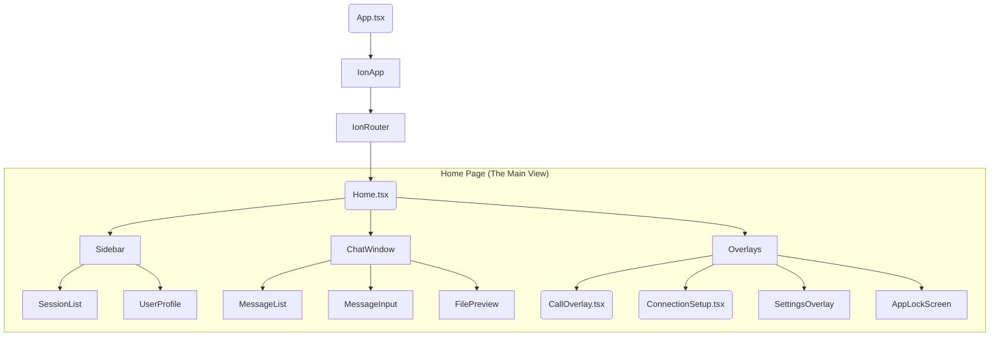

# System Architecture

## Overview

The Secure Chat Application is a real-time communication platform utilizing a **"Thick Client, Thin Server"** architecture. The server acts solely as an ephemeral relay, while the client handles all business logic, encryption, storage, and state management.



## 1. Backend Service (Relay Server)

### Technology & Configuration

- **Language**: Go (Golang)
- **WebSocket Library**: Gorilla WebSocket
- **Port**: 9000
- **Protocol**: WebSocket (`ws://` or `wss://` for production)

### Responsibilities

The relay server is intentionally minimal. It:

1. **Validates Authentication**: Verifies Google ID Tokens against Google's OAuth API
2. **Manages Sessions**: Maintains ephemeral mappings of `SessionID → [Connected Clients]`
3. **Relays Encrypted Payloads**: Forwards encrypted messages between clients in the same session
4. **Logs Connections**: Records hashed connection attempts for security auditing
5. **Issues Session Tokens**: Generates HMAC-signed tokens to reduce repeated OAuth calls

### What the Server Cannot Do

- ❌ Decrypt message content (does not have session keys)
- ❌ Store chat history (all data is ephemeral, in-memory only)
- ❌ View file contents (files are encrypted at the client)
- ❌ Access user profiles or contacts (no persistent user database)

### Server Data Structures

```go
type Client struct {
    id    string           // Unique connection ID
    email string           // Google-verified email
    conn  *websocket.Conn  // WebSocket connection
    mu    sync.Mutex       // Thread-safe writes
}

type Session struct {
    id      string                  // Session ID (shared by peers)
    clients map[string]*Client      // All clients in this session
    mu      sync.Mutex              // Thread-safe access
}

type Server struct {
    clients         map[string]*Client       // All connected clients
    sessions        map[string]*Session      // All active sessions
    emailToClientId map[string]string        // Email → Active ClientID lookup
    mu              sync.Mutex               // Thread-safe state mutations
    logger          *log.Logger              // Connection logging
}
```

## 2. Frontend Client (The Core)

The client is a React application wrapped in Capacitor, enabling it to run as a Android app, or Electron desktop app.

### Core Services (`src/services/`)

primary business logic resides in singleton services that exist outside the React component tree.

#### `ChatClient.ts` (The Brain)

- **Role**: Central controller for networking, encryption, and state.
- **Key Functions**:
  - `init()`: Establishes WebSocket connection.
  - `encryptForSession(sid, data)`: Encrypts payloads using per-session keys.
  - `sendFile()`: Handles chunked file uploads/downloads.
  - `startCall()`: Manages MediaRecorder/AudioContext for secure streaming.
- **Events**: Extends `EventEmitter`. Emits events like `message`, `session_updated`, `call_incoming` to the UI.

#### `AccountService.ts`

- **Role**: Identity management.
- **Storage**: Persists account headers (email, token, display name) in Secure Storage.
- **Multi-Account**: Supports switching active databases based on user email.

#### `SafeStorage.ts`

- **Role**: Interface for platform-specific secure storage.
- **Implementation**: Uses Capacitor's secure storage plugins (Keychain/Keystore) to save sensitive Keys (Identity Private Keys, Session Tokens).

#### `sqliteService.ts`

- **Role**: Local persistence.
- **Data**: Stores plain-text (decrypted) chat history, contact lists, and session metadata.
- **Encryption**: The database is encrypted using CapacitorSQLite's built-in encryption. Each account uses a unique 128-bit BIP39 mnemonic (12 words) as the encryption key, which is securely stored in the platform's keychain/keystore and applied via `setEncryptionSecret()` before opening the database.

### component Hierarchy



### State Management Pattern

The app uses an **Event-Driven-State-Sync** pattern.

1. **Source of Truth**: `ChatClient` and `SQLite` hold the true state.
2. **Sync**: React components (like `Home.tsx`) subscribe to `ChatClient` events.
3. **Usage**: `useChatLogic` hook acts as the bridge.
   - Listens to `ChatClient.on('message')`.
   - Re-queries SQLite.
   - Updates React State (`useState`) to trigger re-renders.

## 3. Data Flow

### A. Login Flow

1. User signs in with Google.
2. `App` receives `id_token`.
3. `ChatClient` sends `AUTH` frame with `id_token` to Server.
4. Server verifies token with Google API.
5. Server responds with `AUTH_SUCCESS` + `session_token`.
6. Client stores `session_token` in `SafeStorage`.

### B. Session Establishment (P-256 Key Exchange)

1. User A requests User B (by email).
2. Server routes request.
3. **Client A** generates ECDH KeyPair. Sends `Public Key A` to B.
4. **Client B** accepts. Generates ECDH KeyPair. Sends `Public Key B` to A.
5. Both clients use `crypto.subtle.deriveKey(ECDH, Public_Peer)` to generate a shared `AES-GCM` session key.
6. This key is stored locally in `sessions` table. **The server never sees this key.**

### C. Messaging (End-to-End Encrypted)

1. User types "Hello".
2. `ChatClient` encrypts "Hello" with the Session Key (`AES-GCM`).
3. Payload sent to Server: `{ t: "MSG", sid: "...", data: <EncryptedBlob> }`.
4. Server relays `<EncryptedBlob>` to Peer.
5. Peer receives, decrypts with local Session Key, and saves "Hello" to SQLite.
