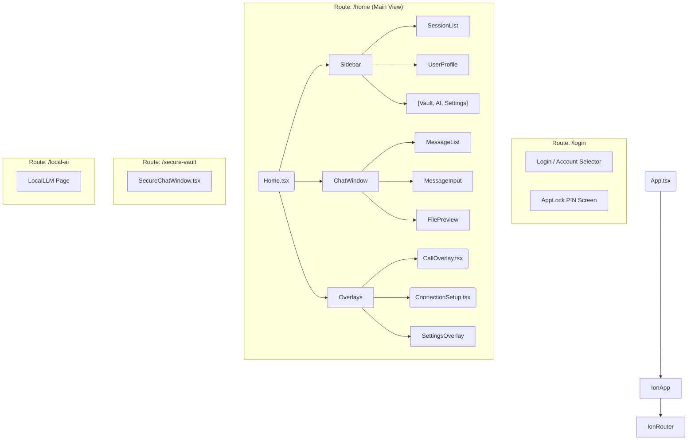

# System Architecture

## Overview

The Secure Chat Application (CryptNode) is a real-time communication platform utilizing a **"Thick Client, Thin Server"** architecture. The server acts solely as an ephemeral relay, while the client handles all business logic, encryption, storage, and state management.

## 1. Backend Service (Relay Server)

### Technology & Configuration

- **Language**: Go (Golang)
- **WebSocket Library**: Gorilla WebSocket
- **Database**: SQLite (`go-sqlite3`) — server-side only, stores ephemeral session metadata, pending friend requests, and offline notification queues (never stores message content)
- **Port**: 9000
- **Protocol**: WebSocket (`ws://` or `wss://` for production)

### Responsibilities

The relay server is intentionally minimal. It:

1. **Validates Authentication**: Verifies Google ID Tokens against Google's OAuth API, or validates its own HMAC-signed session tokens
2. **Manages Sessions**: Maintains ephemeral mappings of `SessionID → [Connected Clients]`
3. **Relays Encrypted Payloads**: Forwards encrypted messages between clients in the same session
4. **Logs Connections**: Records hashed connection attempts for security auditing
5. **Issues Session Tokens**: Generates HMAC-signed tokens to reduce repeated OAuth calls
6. **Stores Pending Requests**: Persists `FRIEND_REQUEST` payloads in SQLite so they can be delivered when the target user next comes online
7. **Queues Offline Notifications**: Stores `FRIEND_DENIED`, `USER_BLOCKED_EVENT` notifications for offline delivery
8. **Hosts Static Website**: Serves an informational/landing website with download links to precompiled binaries in `website/`

### What the Server Cannot Do

- ❌ Decrypt message content (does not have session keys)
- ❌ Store chat history (all data is ephemeral, in-memory or pending-delivery only)
- ❌ View file contents (files are encrypted at the client)
- ❌ Access user profiles or contacts (no persistent user database)

### Server Data Structures

```go
type Client struct {
    id        string           // Unique connection ID
    email     string           // Google-verified email
    conn      *websocket.Conn  // WebSocket connection
    mu        sync.Mutex       // Thread-safe writes
    publicKey string           // Device ECDH public key (Base64)
}

type Session struct {
    id      string                  // Session ID (deterministic SHA-256 hash of sorted emails)
    clients map[string]*Client      // All clients in this session
    mu      sync.Mutex              // Thread-safe access
}

type Server struct {
    clients         map[string]*Client       // All connected clients
    sessions        map[string]*Session      // All active sessions
    emailToClientId map[string]string        // Email → Active ClientID[] lookup (multi-device)
    mu              sync.Mutex               // Thread-safe state mutations
    logger          *log.Logger              // Connection logging
}
```

## 2. Frontend Client (The Core)

The client is a React 18 application built with Vite and wrapped in Capacitor, enabling it to run as an Android app or Electron desktop app.

### Core Services (`src/services/`)

Primary business logic resides in singleton services that exist outside the React component tree, organized into domain-specific directories.

#### `core/ChatClient.ts` — The Orchestrator

- **Role**: Central singleton controller. Acts as a facade over all sub-services. All UI interactions go through `ChatClient`.
- **Key Functions**:
  - `init()`: Loads sessions from SQLite on startup.
  - `login(token)`: Delegates to `AuthService`, triggers WS connection.
  - `lockSession()`: Clears in-memory auth state, disconnects WS, returns to login screen **without** clearing the stored session token.
  - `logout(isManualLogout)`: Full logout — clears in-memory state AND wipes the stored session token from `SafeStorage`.
  - `sendMessage(...)`: Delegates to `MessageService`.
  - `sendFile(...)`: Delegates to `FileTransferService`.
  - `startCall(...)`: Delegates to `CallService`.
  - `encryptForSession(sid, data, priority)`: Delegates to `SessionService.encrypt()`.
  - `broadcastProfileUpdate()`: Sends profile + manifest to all peers and own devices.
- **Events**: Extends `EventEmitter`. Emits events like `message`, `session_updated`, `auth_success`, `auth_error`, `inbound_request` to the UI.
- **Multi-Device Message Routing**: For incoming `MSG` frames with `data.payloads` (a keyed map), extracts only the payload addressed to the current device's public key before decrypting.

#### `core/SocketManager.ts` — Raw WebSocket

- **Role**: Manages the raw WebSocket connection lifecycle.
- **Key Features**: Auto-reconnect with exponential backoff, message serialization/deserialization, event emitter for connection state changes (`WS_CONNECTED`, `WS_DISCONNECTED`).

#### `core/WorkerManager.ts` — Crypto Parallelism

- **Role**: Manages a pool of `crypto.worker.ts` Web Workers to perform encryption/decryption off the main thread.
- **Priority Queue**: Work items have a numeric priority (`p`) so that high-priority frames (e.g., sync) don't get blocked by lower-priority work.

#### `messaging/SessionService.ts` — Session Lifecycle

- **Role**: Manages the full lifecycle of peer connections (sessions) — from friend request to unfriend.
- **Key Functions**:
  - `connectToPeer(email)`: Sends `GET_PUBLIC_KEY` to server.
  - `sendFriendRequest(email, remotePubKeys)`: Encrypts profile for each of target's device keys, sends `FRIEND_REQUEST`.
  - `acceptFriend(email, remotePubKeys, senderHash)`: Encrypts accept payload, sends `FRIEND_ACCEPT`, waits for `FRIEND_ACCEPTED_ACK`, then calls `finalizeSession`.
  - `finalizeSession(sid, remotePubB64s, ...)`: The core key-derivation step. For each new peer public key, derives an AES-GCM session key via ECDH. Serializes keys as JWKs to SQLite and initializes `WorkerManager`.
  - `handleSessionList(list)`: Reconciles server session state on login, triggering key re-derivation if public keys have changed (e.g., peer reinstalled app).
  - `setPeerOnline(sid, online, newPeerPubKeys)`: Updates in-memory presence. If peer's public keys changed, re-derives session keys.
  - `blockUser / unblockUser`: Manages the `blocked_users` SQLite table.
- **Finalization Lock**: Uses a per-SID `Promise` chain (`finalizeLocks`) to serialize concurrent `finalizeSession` calls for the same SID, preventing race conditions during handshake.

#### `messaging/MessageService.ts` — Message Operations

- **Role**: Handles all message-level operations.
- **Key Functions**:
  - `sendMessage(sid, text, ...)`: Encrypts and sends a `MSG` frame; saves message to SQLite.
  - `handleMsg(sid, payload, senderHash, priority)`: Decrypts incoming payload; dispatches to specific handlers based on inner message type (TEXT, DELETE, FILE_INFO, CALL_START, MANIFEST, etc.).
  - `editMessage(sid, messageId, newText)`: Sends an encrypted `EDIT` inner packet; updates SQLite.
  - `deleteMessage(sid, messageId, forEveryone)`: Hard delete locally; optionally sends `DELETE` inner packet to peer.
  - `deleteChatLocally(sid, removeFromUi)`: Deletes all messages for a session from SQLite without touching the session record.
  - `sendReaction(sid, messageId, emoji, action)`: Sends `REACTION` inner packet; updates reaction data in SQLite.
  - `broadcastManifestToOwnDevices()`: Sends `MANIFEST` (blocks, requests, aliases, profile, recent messages) to all sessions where the peer is the same user (i.e., own linked devices).
  - `sendManifestToPeer(sid)`: Pushes missed messages to a peer who just came online.
  - `coordinateSync(sid)`: Orchestrates both own-device and peer manifest pushes for a session.
  - `syncPendingMessages()`: Retries sending messages in the local SQLite with `status = 1` (pending).
  - `broadcastProfileUpdate()`: Sends `PROFILE_VERSION` to all online sessions.
  - `broadcastSyncCallAction(type, callSid)`: Notifies own devices of call accept/end for multi-device awareness.

#### `auth/AuthService.ts` — Authentication

- **Role**: Manages Google OAuth tokens, device identity keys, and account switching.
- **Two-Phase Account Switching**:
  - `switchAccountLocal(email)`: Phase 1 — unlocks local SQLite DB immediately (no network). Unblocks UI.
  - `switchAccountConnect(email, pubKey, token)`: Phase 2 — connects WebSocket + authenticates server in background.
  - `switchAccount(email)`: Full blocking version that awaits both phases.
- **Identity Keys**: On first login, generates a permanent ECDH P-256 identity key pair and stores it in `SafeStorage`. On subsequent logins, loads the existing pair.
- **Database Key**: Generates a 12-word BIP39 mnemonic as the SQLite encryption key, stored in `SafeStorage`.

#### `auth/AccountService.ts` — Account Registry

- **Role**: Manages the on-device registry of all known Google accounts (persisted as a JSON array in `SafeStorage`).
- Provides helpers for deterministic key name generation (`getStorageKey`) and database name derivation (`getDbName`, using SHA-256 of email).

#### `storage/SafeStorage.ts` — Secure Key Store

- **Role**: Interface for platform-specific secure storage.
- **Implementation**: Uses Capacitor's secure storage plugins (Keychain on iOS, Keystore on Android, encrypted `electron-store` on Desktop) to save all sensitive secrets.

#### `storage/sqliteService.ts` — Local Database

- **Role**: All local persistence.
- **Data**: Stores decrypted chat history, contact sessions, pending requests, blocked users, vault items, device identity info.
- **Encryption**: Each account's database is encrypted using CapacitorSQLite's built-in encryption, keyed by the account's unique BIP39 mnemonic.

#### `storage/StorageService.ts` — File Storage

- **Role**: Manages file blobs on the local Capacitor Filesystem (for vault media, avatars, and received files).

#### `storage/BackupService.ts` — Backup & Restore

- **Role**: Exports and restores all user data (messages, keys, vault media) as an AES-GCM-256 encrypted ZIP file protected by a mnemonic.

#### `media/CallService.ts` — WebRTC Calls

- **Role**: Manages WebRTC audio and video calls, relayed via TURN server.
- **Signaling**: SDP offers/answers and ICE candidates are exchanged end-to-end encrypted via the WebSocket channel, using the session's AES-GCM key. The relay server sees only opaque blobs.
- **TURN**: Requests ephemeral TURN credentials from the server (`GET_TURN_CREDS`) for NAT traversal.
- **Media Encryption**: DTLS-SRTP (standard WebRTC) encrypts the actual audio/video streams.

#### `media/FileTransferService.ts` — Chunked File Transfer

- **Role**: Handles sending and receiving files in 250KB encrypted chunks (~256,000 bytes per chunk).

#### `media/CompressionService.ts` — Media Compression

- **Role**: Compresses images/videos before upload to reduce transfer size.

#### `ai/localAI.service.ts` — Local AI Assistant

- **Role**: Interface for executing GGUF language models entirely on-device via a native llama.cpp backend exposed through Electron's preload as `window.llama`.
- **Execution**: Electron (Windows/Linux) only. Throws if `window.llama` is not present. Capacitor `Filesystem` is used for model file download and storage management.
- **Features**: Smart Compose, Quick Replies, Summarize, stateless session isolation between utility calls.

#### `mfa/mfa.service.ts` — TOTP MFA

- **Role**: Client-side only TOTP (RFC 6238) generation and verification for Secure Vault access. The relay server is entirely uninvolved.

### Component Hierarchy


```mermaid
graph TD
    App(App.tsx) --> IonApp
    IonApp --> IonRouter

    subgraph "Route: /login"
        LoginScreen[Login / Account Selector]
        AppLockScreen[AppLock PIN Screen]
    end

    subgraph "Route: /home (Main View)"
        Home(Home.tsx) --> Sidebar
        Home --> ChatWindow
        Home --> Overlays

        Sidebar --> SessionList
        Sidebar --> UserProfile
        Sidebar --> ToolButtons["[Vault, AI, Settings]"]

        ChatWindow --> MessageList
        ChatWindow --> MessageInput
        ChatWindow --> FilePreview

        Overlays --> CallOverlay(CallOverlay.tsx)
        Overlays --> ConnectionSetup(ConnectionSetup.tsx)
        Overlays --> SettingsOverlay
    end

    subgraph "Route: /secure-vault"
        SecureChatWindow[SecureChatWindow.tsx]
    end

    subgraph "Route: /local-ai"
        LocalLLMPage[LocalLLM Page]
    end
```

### State Management Pattern

The app uses an **Event-Driven-State-Sync** pattern.

1. **Source of Truth**: `ChatClient` (in-memory) and `SQLite` (on-disk) hold the true state.
2. **Sync**: React components subscribe to `ChatClient` events via hooks.
3. **Bridge**: `useChatLogic` (and page-level hooks) listen to events like `ChatClient.on('message')`, re-query SQLite, and update React state (`useState`) to trigger re-renders.

## 3. Data Flow

### A. Login Flow (Full)

1. User taps "Sign in with Google" → Google OAuth consent → `id_token` received.
2. `AuthService.login(id_token)`:
   a. Sets up device keys (generates or loads ECDH identity key pair).
   b. Opens/creates the user's encrypted SQLite database.
   c. Connects WebSocket to relay server.
3. On `WS_CONNECTED`, `ChatClient` loads local sessions from SQLite, then sends `AUTH { token, publicKey }` to server.
4. Server validates token, emits `AUTH_SUCCESS { email, newSessionToken }`.
5. Client saves new session token to `SafeStorage`, broadcasts `auth_success` event.
6. Server immediately pushes `SESSION_LIST` and `PENDING_REQUESTS` after `AUTH_SUCCESS`.

### B. Session Establishment (P-256 ECDH Key Exchange)

1. User A enters User B's email → `SessionService.connectToPeer(email)` → sends `GET_PUBLIC_KEY`.
2. Server responds with `PUBLIC_KEY { publicKeys: [pubB64,...], targetEmail }` (all of User B's device keys).
3. `SessionService.sendFriendRequest(email, publicKeys)`: For each of User B's public keys, derives a temporary shared key via ECDH and encrypts User A's profile into an encrypted packet. Sends `FRIEND_REQUEST { targetEmail, payloads: [{publicKey, encryptedPacket}, ...] }`.
4. Server stores request for offline delivery. If User B is online, forwards the payload array.
5. User B's device receives `FRIEND_REQUEST`, iterates over payloads, finds the one matching its own public key, decrypts User A's profile. UI shows incoming request.
6. User B clicks "Accept" → `SessionService.acceptFriend(targetEmail, remotePubKeys, senderHash)`: Encrypts own profile for each of User A's keys, sends `FRIEND_ACCEPT`.
7. Server registers the session in its `friends` table, sends `FRIEND_ACCEPTED_ACK` to User B and `FRIEND_ACCEPTED` to User A.
8. Both clients derive AES-GCM-256 session keys from the ECDH shared secret. Keys stored in SQLite. Session is active.

### C. Messaging (End-to-End Encrypted, Multi-Device)

1. User types "Hello" → calls `ChatClient.sendMessage(sid, "Hello")`.
2. `MessageService` generates a message ID (`crypto.randomUUID()`), timestamp, saves message to SQLite (status = pending). The `sid` passed in is the **session ID** — a SHA-256 hash of the two sorted email addresses, identifying which peer conversation this message belongs to.
3. `SessionService.encrypt(sid, plaintext, priority)` → `WorkerManager` encrypts "Hello" **individually** for each connected peer device and the user's own linked devices, using the appropriate per-device session key (AES-GCM with a fresh 12-byte random IV).
4. Sends `MSG { t, sid, data: { payloads: {[pubKey]: encryptedBlob} } }` to server.
5. Server routes each encrypted blob to the correct device by matching the public key.
6. Each receiving device decrypts with its specific local session key, saves "Hello" to SQLite.
7. Receiving device sends `DELIVERED` back; sender updates message status to 2.

### D. Cross-Device Sync (MANIFEST)

When a device comes online or state changes:
1. `MessageService.broadcastManifestToOwnDevices()` sends an encrypted `MANIFEST` inner packet to all sessions where `peerEmailHash` equals the current user's own email hash.
2. The MANIFEST contains sections: `blocks`, `requests`, `aliases`, `profile`, `messages` (recent).
3. Receiving own-device merges each section with last-write-wins logic.
4. `MessageService.sendManifestToPeer(sid)` pushes missed messages to peer contacts who just came online. Both sides push symmetrically.
