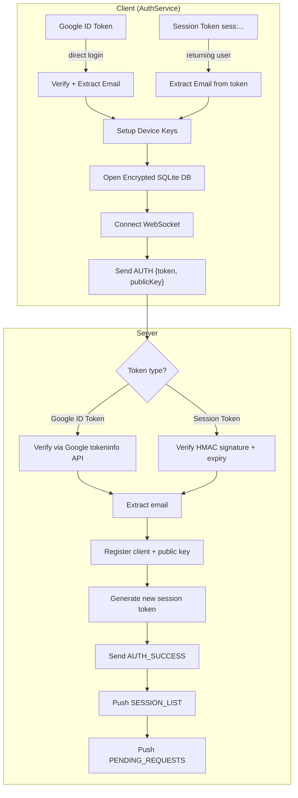
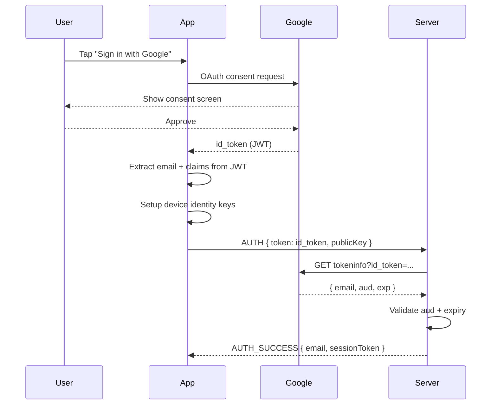
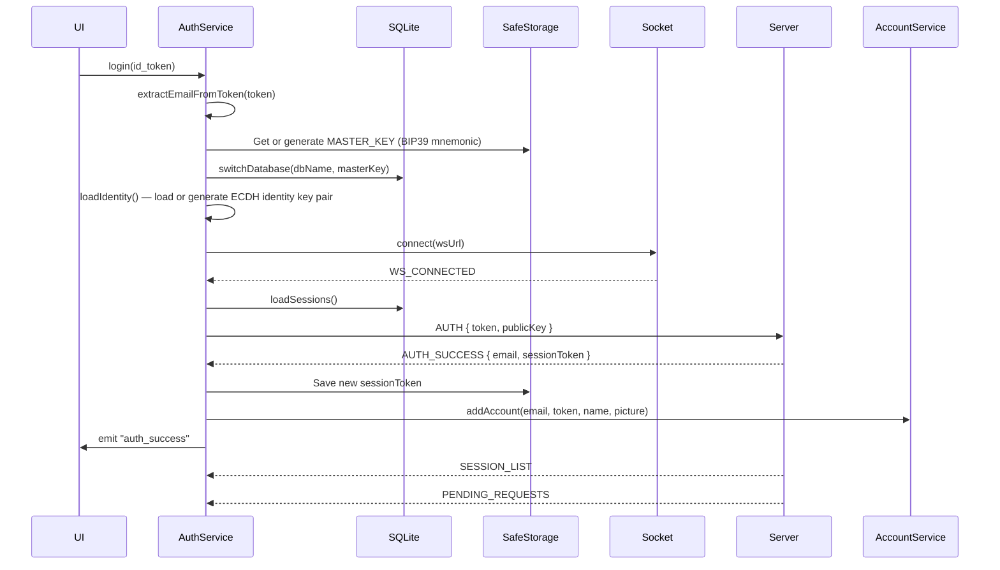

# Authentication & Authorization

This document describes the complete authentication and authorization system including Google OAuth integration, session token lifecycle, session lock, multi-account support, and multi-device behavior.

## Authentication Architecture



## 1. Google OAuth Integration

### OAuth Flow

The app uses Google OAuth 2.0 for identity verification. The client never handles a password — only Google-signed JWTs.



### ID Token Structure

Google returns a JWT with the following relevant claims:

```json
{
  "iss": "https://accounts.google.com",
  "aud": "588653192623-aqs0s01hv62pbp5p7pe3r0h7mce8m10l.apps.googleusercontent.com",
  "sub": "1234567890",
  "email": "user@example.com",
  "email_verified": true,
  "iat": 1234567890,
  "exp": 1234571490
}
```

Only the `email` claim is used — it is the user's identity throughout the app.

### Server-Side Validation

```go
func verifyGoogleToken(token string) (string, error) {
    resp, err := http.Get("https://oauth2.googleapis.com/tokeninfo?id_token=" + token)
    if err != nil || resp.StatusCode != 200 {
        return "", fmt.Errorf("invalid token")
    }

    var claims struct {
        Email string `json:"email"`
        Aud   string `json:"aud"`
    }
    json.NewDecoder(resp.Body).Decode(&claims)

    validClients := map[string]bool{
        "588653192623-aqs0s01hv62pbp5p7pe3r0h7mce8m10l.apps.googleusercontent.com": true, // Web/Electron
        "588653192623-lrcr1rs3meptlo4a2dkt6aam6jpvoua1.apps.googleusercontent.com": true, // Android
    }

    if !validClients[claims.Aud] {
        return "", fmt.Errorf("invalid audience")
    }
    return claims.Email, nil
}
```

---

## 2. Session Token System

### HMAC Session Tokens

After successful Google verification, the server issues a custom session token so that subsequent connections don't require another Google API call.

**Token Format**: `sess:<expiry_unix>:<email>:<hmac_signature>`

**Example**: `sess:1735689600:user@example.com:a3d5f7e9b2c1...`

### Token Generation (Server)

```go
var sessionSecret []byte  // Random 32-byte key generated on server start

func generateSessionToken(email string) string {
    exp := time.Now().Add(30 * 24 * time.Hour).Unix()  // 30-day expiry
    data := fmt.Sprintf("sess:%d:%s", exp, email)

    h := hmac.New(sha256.New, sessionSecret)
    h.Write([]byte(data))
    sig := hex.EncodeToString(h.Sum(nil))

    return fmt.Sprintf("%s:%s", data, sig)
}
```

### Token Validation (Server)

```go
func verifyAuthToken(token string) (string, string, error) {
    if strings.HasPrefix(token, "sess:") {
        parts := strings.Split(token, ":")
        if len(parts) != 4 { return "", "", fmt.Errorf("invalid format") }

        expStr, email, sig := parts[1], parts[2], parts[3]
        data := fmt.Sprintf("sess:%s:%s", expStr, email)

        h := hmac.New(sha256.New, sessionSecret)
        h.Write([]byte(data))
        expectedSig := hex.EncodeToString(h.Sum(nil))

        if !hmac.Equal([]byte(sig), []byte(expectedSig)) {
            return "", "", fmt.Errorf("invalid signature")
        }
        exp, _ := strconv.ParseInt(expStr, 10, 64)
        if time.Now().Unix() > exp {
            return "", "", fmt.Errorf("expired")
        }
        return email, token, nil
    }

    // Google ID token path
    email, err := verifyGoogleToken(token)
    if err != nil { return "", "", err }
    newToken := generateSessionToken(email)
    return email, newToken, nil
}
```

### Token Storage (Client)

```typescript
// After AUTH_SUCCESS — save refreshed token
const key = await AccountService.getStorageKey(email, "auth_token");
await setKeyFromSecureStorage(key, sessionToken);

// On future app restart — load saved token
const tokenKey = await AccountService.getStorageKey(email, "auth_token");
const savedToken = await getKeyFromSecureStorage(tokenKey);
await ChatClient.login(savedToken);
```

**Token Security Properties**:

| Token Type | Storage | Transmission | Expiry |
|---|---|---|---|
| Google ID Token | Never stored | TLS only | ~1 hour |
| Session Token | SafeStorage (Keychain/Keystore) | WebSocket (TLS) | 30 days |
| Identity Private Key | SafeStorage | Never transmitted | Indefinite |
| Session AES Keys | SQLite (encrypted) | Never transmitted | Indefinite |

---

## 3. Logout vs. Session Lock

These two actions have fundamentally different effects on stored credentials:

### `logout(isManualLogout?: boolean)`

```typescript
public async logout(isManualLogout = false) {
    if (this.userEmail) {
        const key = await AccountService.getStorageKey(this.userEmail, "auth_token");
        await setKeyFromSecureStorage(key, "");   // Wipes stored token
        await AccountService.updateToken(this.userEmail, "");
    }
    this.authToken = null;
    this.userEmail = null;
    this.identityKeyPair = null;
    socket.disconnect();
    this.emit("auth_error", { isManualLogout });
}
```

After logout, the user must re-authenticate with Google to obtain a new session token.

**What Logout Does NOT Delete**:
- Local SQLite database (chat history survives)
- Identity key pair in SafeStorage
- Session AES keys in SQLite
- The account entry in SafeStorage (account stays in selector list)

### `lockSession()`

```typescript
public lockSession() {
    this.authToken = null;     // Clear in-memory token
    this.userEmail = null;     // Clear in-memory email
    this.identityKeyPair = null;
    socket.disconnect();
    this.emit("auth_error", { isManualLogout: true });
    // Note: Does NOT wipe SafeStorage token — user can unlock without Google
}
```

After locking, the user is returned to the Account Selector. They can tap their account and enter their PIN to instantly unlock (via `switchAccountLocal`), with no Google re-authentication required.

---

## 4. Multi-Account Support

### Account Data Structure

```typescript
interface StoredAccount {
    email: string;
    token: string;          // Last known session token (may be re-freshened on next AUTH_SUCCESS)
    lastActive: number;     // Timestamp of last login
    displayName?: string;   // User-set or fetched from Google claims
    avatarUrl?: string;     // Local file path or data URI
}
```

All accounts stored in `SafeStorage` under the key `chatapp_accounts`.

### Database Isolation

Each account uses a separate, independently encrypted SQLite database:

```typescript
async function getDbName(email: string): Promise<string> {
    const hashHex = await sha256(email.toLowerCase().trim());
    return `user_${hashHex.substring(0, 16)}`;
    // Example: "user_a3f7d2e1c4b8f9a2"
}
```

The database is encrypted using a unique 12-word BIP39 mnemonic (stored in `SafeStorage`), so each account's data is completely isolated.

### Two-Phase Account Switch

The account switch is split into two phases to ensure the UI is never blocked on network I/O:

```typescript
// Phase 1: Unlock local DB — runs synchronously, no network
public async switchAccountLocal(email: string): Promise<{ pubKey: string; token: string }> {
    // 1. Read session token from SafeStorage
    // 2. Load identity keys from SafeStorage
    // 3. Open the user's encrypted SQLite database
    // → UI can render immediately after this
}

// Phase 2: Connect to server — runs in background
public async switchAccountConnect(email: string, pubKey?: string, token?: string): Promise<void> {
    // 1. Disconnect existing WebSocket
    // 2. Connect new WebSocket to relay server
    // 3. Send AUTH frame
    // 4. Wait for AUTH_SUCCESS (15s timeout)
}
```

---

## 5. Multi-Device Login

Multiple devices under the same Google account can be logged in concurrently. The server supports this by tracking multiple client connections per email, each tagged with their unique device public key.

### How Multi-Device Routing Works

1. Each device registers its unique ECDH public key with the server on AUTH
2. When User A sends a message to User B, it encrypts the payload separately for each of User B's device keys
3. The MSG frame carries `data.payloads` — a map of `{ [devicePubKey]: encryptedBlob }`
4. The server routes each blob to the corresponding device

### Cross-Device State Sync

When any state changes on one device (new message, block action, profile update), the device broadcasts a `MANIFEST` frame to its own linked devices (sessions where `peerEmailHash` == own email hash). This ensures all devices stay synchronized without requiring a central state store.

---

## 6. Login Flow (Complete Sequence)



---

## 7. Session Expiry Handling

```typescript
// Server sends ERROR when session token is invalid or expired
case "ERROR":
    if (data.message === "Auth failed" ||
        data.message === "Authentication required") {
        await this.authService.logout();
        // User is returned to login screen
    }
```

---

## 8. Authorization Model

The app uses a flat, peer-to-peer authorization model with no roles or admin privileges:

| Resource | Authorization Rule |
|---|---|
| Own Messages | Can read/edit/delete own messages |
| Session Messages | Can view messages in sessions they are part of |
| Session Keys | Only accessible locally on device (never transmitted) |
| Identity Keys | Private key never leaves device's SafeStorage |
| Peer Profile | Name/avatar shared during handshake, stored locally |
| Other User Data | No access — zero server storage |

### No Server-Side Access Control

The relay server enforces only authentication (are you who you say you are?). All authorization (can you access this data?) is enforced at the client level by:
- Sender hash (`sh`) validation before processing `MSG` frames
- Block list checks before processing friend requests and messages
- Local-only session key storage

---

## 9. Platform-Specific Authentication

### Android

- Uses Google Sign-In Android SDK (`@codetrix-studio/capacitor-google-auth`)
- APK signed with registered SHA-1 fingerprint in Google Cloud Console
- `SafeStorage` uses Android Keystore (hardware-backed on supporting devices)

### Desktop (Electron)

- Uses Web OAuth flow in Electron's main browser window
- `SafeStorage` uses `electron-store` with encryption
- Same client ID as the web version
- `electron/preload.js` exposes secure storage APIs via context bridge

---

## 10. Account Recovery

**Current Status**: No server-side account recovery mechanism exists.

- Lost device = lost access to that device's message history
- No password reset (no passwords)
- Session tokens expire after 30 days; Google re-auth issues a new one

**Mitigation**: Users should create encrypted backups via Settings → Backup & Restore. A backup file contains the master key, identity keys, and all messages, allowing full restoration on a new device after a Google re-login.
