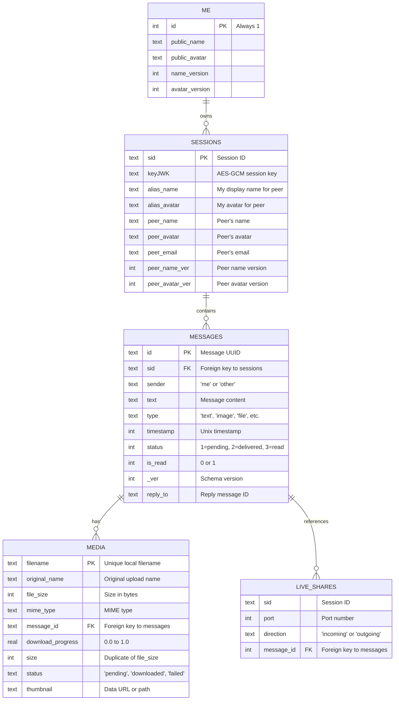
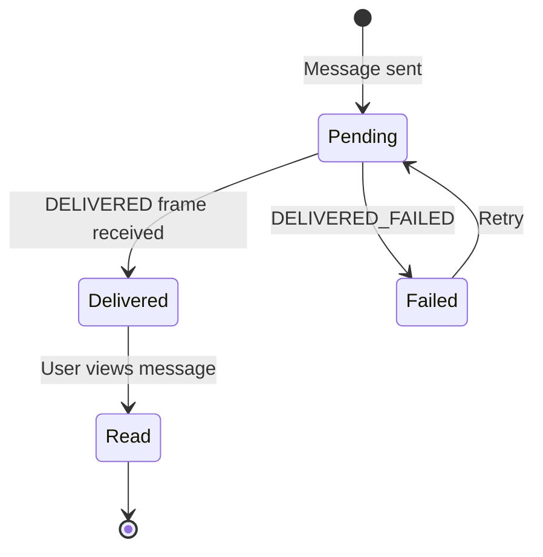

# Database Schema

This document describes the complete SQLite database schema used for local storage on each client.

## Database Overview

- **Database per Account**: Each user account has a separate encrypted SQLite database
- **Database Naming**: `user_{hash}` where hash is derived from email
- **Encryption**: Optional encryption via SQLite encryption extension with passphrase from SecureStorage
- **Location**: Platform-specific data directory (e.g., Android: `app-data://`, Web: IndexedDB-backed)

## Entity Relationship Diagram



## Table Definitions

### 1. `me` Table

Stores the user's own profile information. **Always contains exactly one row (id=1)**.

```sql
CREATE TABLE me (
    id INTEGER PRIMARY KEY CHECK (id = 1),
    public_name TEXT,
    public_avatar TEXT,
    name_version INTEGER DEFAULT 1,
    avatar_version INTEGER DEFAULT 1
);
```

| Column           | Type    | Description                               |
| ---------------- | ------- | ----------------------------------------- |
| `id`             | INTEGER | Always 1 (enforced by CHECK constraint)   |
| `public_name`    | TEXT    | User's display name                       |
| `public_avatar`  | TEXT    | Data URL or path to avatar image          |
| `name_version`   | INTEGER | Increments when name changes (for sync)   |
| `avatar_version` | INTEGER | Increments when avatar changes (for sync) |

**Usage**:

- Updated when user changes profile
- Queried when connecting to new peers
- Versions sent to peers for profile sync

### 2. `sessions` Table

Stores peer connection metadata and session encryption keys.

```sql
CREATE TABLE sessions (
    sid TEXT PRIMARY KEY UNIQUE,
    keyJWK TEXT,
    alias_name TEXT,
    alias_avatar TEXT,
    peer_name TEXT,
    peer_avatar TEXT,
    peer_email TEXT,
    peer_name_ver INTEGER DEFAULT 0,
    peer_avatar_ver INTEGER DEFAULT 0
);
```

| Column            | Type    | Description                                 |
| ----------------- | ------- | ------------------------------------------- |
| `sid`             | TEXT    | Session ID (format: `{timestamp}_{random}`) |
| `keyJWK`          | TEXT    | JSON Web Key (JWK) of AES-GCM session key   |
| `alias_name`      | TEXT    | Display name shown to peer (optional)       |
| `alias_avatar`    | TEXT    | Avatar shown to peer (optional)             |
| `peer_name`       | TEXT    | Peer's display name                         |
| `peer_avatar`     | TEXT    | Peer's avatar (Data URL)                    |
| `peer_email`      | TEXT    | Peer's email address                        |
| `peer_name_ver`   | INTEGER | Last received peer name version             |
| `peer_avatar_ver` | INTEGER | Last received peer avatar version           |

**Session Key Storage**:

```typescript
// Example keyJWK value
{
  "kty": "oct",
  "k": "base64-encoded-shared-secret",
  "alg": "A256GCM",
  "ext": true
}
```

**Lifecycle**:

- Row inserted when connection established
- Updated when peer profile changes
- Never deleted (preserves history)

### 3. `messages` Table

Stores all chat messages (decrypted) for all sessions.

```sql
CREATE TABLE messages (
    id TEXT PRIMARY KEY,
    sid TEXT,
    sender TEXT,
    text TEXT,
    type TEXT DEFAULT 'text',
    timestamp INTEGER,
    status INTEGER DEFAULT 1,
    is_read INTEGER DEFAULT 0,
    _ver INTEGER DEFAULT 2,
    reply_to TEXT,
    FOREIGN KEY(sid) REFERENCES sessions(sid) ON DELETE CASCADE
);

CREATE INDEX IF NOT EXISTS idx_msg_sid ON messages(sid);
```

| Column      | Type    | Description                                         |
| ----------- | ------- | --------------------------------------------------- |
| `id`        | TEXT    | UUID v4 generated by client                         |
| `sid`       | TEXT    | Foreign key to `sessions.sid`                       |
| `sender`    | TEXT    | `'me'` or `'other'`                                 |
| `text`      | TEXT    | Decrypted message content (or file metadata JSON)   |
| `type`      | TEXT    | `'text'`, `'image'`, `'video'`, `'audio'`, `'file'` |
| `timestamp` | INTEGER | Unix timestamp (milliseconds)                       |
| `status`    | INTEGER | 1=Pending, 2=Delivered, 3=Read                      |
| `is_read`   | INTEGER | 0=Unread, 1=Read                                    |
| `_ver`      | INTEGER | Schema version (currently 2)                        |
| `reply_to`  | TEXT    | Message ID of replied message (optional)            |

**Message Status State Machine**:



**Type-Specific Data**:

For files, the `text` column contains JSON:

```json
{
  "filename": "vacation.jpg",
  "size": 2048576,
  "mimeType": "image/jpeg"
}
```

### 4. `media` Table

Stores metadata for file attachments.

```sql
CREATE TABLE media (
    filename TEXT PRIMARY KEY,
    original_name TEXT,
    file_size INTEGER,
    mime_type TEXT,
    message_id TEXT,
    download_progress REAL DEFAULT 0,
    size INTEGER DEFAULT 0,
    status TEXT DEFAULT 'pending',
    thumbnail TEXT,
    FOREIGN KEY(message_id) REFERENCES messages(id) ON DELETE CASCADE
);

CREATE INDEX IF NOT EXISTS idx_media_msg ON media(message_id);
```

| Column              | Type    | Description                                                |
| ------------------- | ------- | ---------------------------------------------------------- |
| `filename`          | TEXT    | Local vault filename (e.g., `user@gmail.com/_file_abc123`) |
| `original_name`     | TEXT    | Original filename from upload                              |
| `file_size`         | INTEGER | Size in bytes                                              |
| `mime_type`         | TEXT    | MIME type (e.g., `image/png`)                              |
| `message_id`        | TEXT    | Foreign key to `messages.id`                               |
| `download_progress` | REAL    | 0.0 to 1.0 (percentage)                                    |
| `size`              | INTEGER | Duplicate of `file_size` (legacy)                          |
| `status`            | TEXT    | `'pending'`, `'downloading'`, `'downloaded'`, `'failed'`   |
| `thumbnail`         | TEXT    | Data URL of thumbnail (for images/videos)                  |

**Download Flow**:

1. Receive `FILE_INFO` → Insert row with `status='pending'`
2. User clicks download → Update `status='downloading'`, `download_progress=0.0`
3. Chunks received → Update `download_progress`
4. Complete → Update `status='downloaded'`, `download_progress=1.0`

### 5. `live_shares` Table

Stores active screen/port forwarding sessions (advanced feature).

```sql
CREATE TABLE live_shares (
    sid TEXT,
    port INTEGER,
    direction TEXT,
    message_id INTEGER,
    PRIMARY KEY (sid, port, direction),
    FOREIGN KEY(message_id) REFERENCES messages(id) ON DELETE CASCADE
);

CREATE INDEX IF NOT EXISTS idx_shares_msg ON live_shares(message_id);
```

| Column       | Type    | Description                       |
| ------------ | ------- | --------------------------------- |
| `sid`        | TEXT    | Session ID                        |
| `port `      | INTEGER | Local/remote port number          |
| `direction`  | TEXT    | `'incoming'` or `'outgoing'`      |
| `message_id` | INTEGER | Foreign key to initiating message |

**Usage**: Currently unused in standard chat flow. Reserved for future port forwarding/screen sharing features.

## Data Lifecycle

### On First Login

1. Database created with name `user_{hash}`
2. All tables created with schema
3. Insert default row into `me` table

### On Message Send

1. Insert into `messages` (status=1, sender='me')
2. If file attachment, insert into `media`
3. Send encrypted payload to server
4. On `DELIVERED`, update status=2

### On Message Receive

1. Decrypt payload
2. Insert into `messages` (status=2, sender='other')
3. If file metadata, insert into `media` (status='pending')
4. Emit event to UI

### On Session Establish

1. Derive AES-GCM key using ECDH
2. Export key to JWK format
3. Insert into `sessions` table

### On Profile Update

1. Update `me.public_name` or `me.public_avatar`
2. Increment version (`name_version++`)
3. Broadcast `PROFILE_VERSION` to all active sessions

### On Account Switch

1. Close current database connection
2. Open new database for selected account
3. Load `sessions` and messages

### On Account Delete

1. Close database
2. Delete database files from filesystem
3. Remove entry from `SafeStorage`

## Database Migrations

The app uses a **runtime schema sync** approach instead of traditional migrations.

### Schema Synchronization Logic

```typescript
async function syncTableSchema(tableName: string, targetColumns: string) {
  // 1. Get current columns from PRAGMA table_info
  const existing = await queryDB(`PRAGMA table_info(${tableName})`);

  // 2. Compare with target schema
  const addedColumns = findNewColumns(existing, targetColumns);
  const removedColumns = findDeletedColumns(existing, targetColumns);

  // 3. If only additions, use ALTER TABLE ADD COLUMN
  if (addedColumns.length > 0 && removedColumns.length === 0) {
    for (const col of addedColumns) {
      await executeDB(`ALTER TABLE ${tableName} ADD COLUMN ${col}`);
    }
  }

  // 4. If deletions/renames, recreate table
  if (removedColumns.length > 0) {
    await executeDB(`
      CREATE TABLE ${tableName}_new (${targetColumns});
      INSERT INTO ${tableName}_new SELECT ${sharedColumns} FROM ${tableName};
      DROP TABLE ${tableName};
      ALTER TABLE ${tableName}_new RENAME TO ${tableName};
    `);
  }
}
```

**Advantages**:

- No migration version tracking needed
- Schema defined once in code
- Automatically adapts to changes

**Disadvantages**:

- Data loss if columns removed
- No rollback mechanism

## Querying Patterns

### Get All Sessions

```typescript
const sessions = await queryDB(
  `SELECT sid, peer_name, peer_email, peer_avatar
   FROM sessions
   ORDER BY sid DESC`,
);
```

### Get Messages for Session

```typescript
const messages = await queryDB(
  `SELECT m.id, m.sender, m.text, m.type, m.timestamp, m.status, med.thumbnail
   FROM messages m
   LEFT JOIN media med ON m.id = med.message_id
   WHERE m.sid = ?
   ORDER BY m.timestamp ASC`,
  [sessionId],
);
```

### Get Unread Count

```typescript
const result = await queryDB(
  `SELECT sid, COUNT(*) as unread
   FROM messages
   WHERE sender = 'other' AND is_read = 0
   GROUP BY sid`,
);
```

### Update Message Status

```typescript
await executeDB(
  `UPDATE messages SET status = ? WHERE id = ?`,
  [2, messageId], // 2 = Delivered
);
```

## Performance Considerations

### Indexes

Currently only 2 indexes:

- `idx_msg_sid` on `messages(sid)` - Used for "get messages by session"
- `idx_media_msg` on `media(message_id)` - Used for joins

**Recommended Additional Indexes**:

```sql
CREATE INDEX idx_msg_timestamp ON messages(timestamp);  -- For sorting
CREATE INDEX idx_msg_status ON messages(status);  -- For pending message queries
CREATE INDEX idx_msg_unread ON messages(is_read, sender);  -- For unread counts
```

### Database Size

**Typical sizes**:

- Empty database: ~20 KB
- 1000 messages: ~100 KB
- 10,000 messages: ~1 MB
- 100,000 messages + media: ~50-100 MB (depending on thumbnails)

**Growth Factors**:

- Text messages: ~100 bytes each
- Thumbnails: ~5-20 KB each
- Session keys: ~500 bytes each

## Backup & Export

### Manual Backup

```typescript
// Copy database file
const dbPath = await Filesystem.getUri({
  directory: Directory.Data,
  path: `${currentDbName}SQLite.db`,
});

await Filesystem.copy({
  from: dbPath.uri,
  to: "backup_" + Date.now() + ".db",
  directory: Directory.Documents,
});
```

### Export to JSON

```typescript
const sessions = await queryDB(`SELECT * FROM sessions`);
const messages = await queryDB(`SELECT * FROM messages`);

const exportData = {
  version: 1,
  exportedAt: Date.now(),
  sessions,
  messages,
};

await Filesystem.writeFile({
  path: "chat_export.json",
  data: JSON.stringify(exportData),
  directory: Directory.Documents,
});
```

## Security Notes

1. **Encryption**: The database stores DECRYPTED messages. Enable SQLite encryption in production.
2. **Session Keys**: Stored in plaintext (JWK format). Relies on OS-level database encryption.
3. **Foreign Keys**: Enabled via `PRAGMA foreign_keys = ON` to maintain referential integrity.
4. **No Cloud Sync**: Database remains local-only. No built-in cloud backup.
