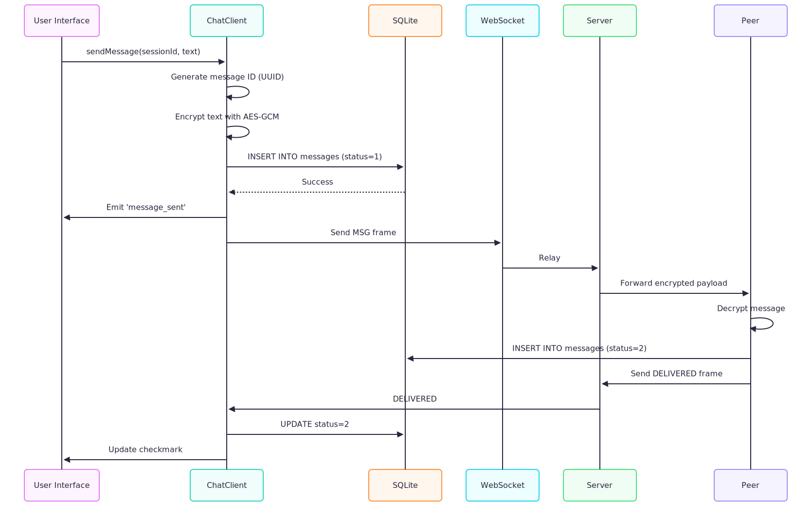
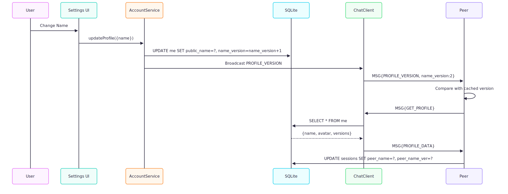

# Features Documentation

This document provides a detailed breakdown of all features in the Secure Chat Application, including purpose, user flows, backend logic, API interactions, data models, and error handling.

## Feature Index

1. [Text Messaging](#1-text-messaging)
2. [File Sharing](#2-file-sharing)
3. [Voice Calls](#3-voice-calls)
4. [Secure Vault](#4-secure-vault)
5. [Profile Management](#5-profile-management)
6. [Session Management](#6-session-management)
7. [Multi-Account Support](#7-multi-account-support)

---

## 1. Text Messaging

### Text Messaging Purpose

Enable users to send and receive end-to-end encrypted text messages in real-time.

### Text Messaging User Flow

1. User selects a peer from session list
2. User types message in input field
3. User presses Send or Enter
4. Message appears immediately in chat (optimistic UI)
5. Status changes from "sending" → "delivered" → "read"

### Text Messaging Backend Flow



### Text Messaging API Interactions

**WebSocket Frame**:

```json
{
  "t": "MSG",
  "sid": "session_id",
  "data": {
    "payload": "encrypted_base64_string"
  }
}
```

**Decrypted Payload**:

```json
{
  "t": "MSG",
  "data": {
    "text": "Hello!",
    "id": "uuid-1234",
    "timestamp": 1704067200000,
    "replyTo": null
  }
}
```

### Text Messaging Data Models

**Database (SQLite)**:

```sql
INSERT INTO messages (id, sid, sender, text, type, timestamp, status, is_read)
VALUES ('uuid-1234', 'session_id', 'me', 'Hello!', 'text', 1704067200000, 1, 0);
```

**In-Memory (ChatClient)**:

```typescript
interface ChatMessage {
  id: string;
  sessionId: string;
  sender: "me" | "other";
  text: string;
  timestamp: number;
  status: 1 | 2 | 3; // Pending | Delivered | Read
}
```

### Text Messaging Error Handling

| Error                  | Cause                          | Recovery                                   |
| ---------------------- | ------------------------------ | ------------------------------------------ |
| **Peer offline**       | No active WebSocket connection | Queue locally, auto-retry on `PEER_ONLINE` |
| **Encryption failure** | Missing session key            | Show error, prompt reconnection            |
| **Network timeout**    | Socket closed mid-send         | Auto-reconnect, resend from queue          |
| **Invalid session**    | Session not found in DB        | Show error, navigate to session list       |

---

## 2. File Sharing

### File Sharing Purpose

Allow users to securely share images, videos, audio, and documents with encryption.

### File Sharing User Flow

1. User clicks attach icon (📎)
2. Native file picker opens
3. User selects file
4. File is previewed (if image)
5. User confirms send
6. File uploads in chunks
7. Peer sees file preview with download button
8. Peer clicks download
9. File transfers in chunks with progress bar
10. File available for viewing/saving

### File Sharing Backend Flow

**Sender Side**:


**Receiver Side**:


### File Sharing API Interactions

**FILE_INFO Frame** (encrypted in MSG):

```json
{
  "t": "FILE_INFO",
  "data": {
    "name": "vacation.jpg",
    "size": 2048576,
    "type": "image/jpeg",
    "thumbnail": "data:image/png;base64,...",
    "messageId": "uuid-5678"
  }
}
```

**FILE_REQ_CHUNK**:

```json
{
  "t": "FILE_REQ_CHUNK",
  "data": {
    "messageId": "uuid-5678",
    "chunkIndex": 0
  }
}
```

**FILE_CHUNK**:

```json
{
  "t": "FILE_CHUNK",
  "data": {
    "messageId": "uuid-5678",
    "chunkIndex": 0,
    "payload": "base64-data",
    "isLast": false
  }
}
```

### File Sharing Data Models

**messages table**:

```sql
INSERT INTO messages (id, sid, sender, text, type, timestamp, status)
VALUES ('uuid-5678', 'session_id', 'me', '{"filename":"vacation.jpg","size":2048576}', 'image', timestamp, 1);
```

**media table**:

```sql
INSERT INTO media (filename, original_name, file_size, mime_type, message_id, status, thumbnail)
VALUES ('vault_abc123', 'vacation.jpg', 2048576, 'image/jpeg', 'uuid-5678', 'pending', 'data:...');
```

### File Sharing Error Handling

| Error               | Cause                        | Recovery                          |
| ------------------- | ---------------------------- | --------------------------------- |
| **Read failure**    | File permissions             | Show error toast                  |
| **Chunk timeout**   | Network drop during transfer | Resume from last successful chunk |
| **Vault full**      | Storage limit reached        | Show "Storage full" error         |
| **Corrupted chunk** | Network corruption           | Request chunk again               |

---

## 3. Voice Calls

### Voice Calls Purpose

Enable real-time, end-to-end encrypted voice and video communication between peers using WebRTC.

### Voice Calls User Flow

1. User clicks phone icon in chat
2. Peer receives incoming call notification
3. Peer accepts call
4. Both users connected (bidirectional audio)
5. Either user hangs up
6. Call duration logged

### Voice & Video Calls Backend Flow

1. **Signaling**: Peers exchange SDP offers/answers and ICE candidates via the WebSocket server (encrypted).
2. **P2P Connection**: Browsers establish a direct P2P connection (or relay via TURN if NAT traversal fails).
3. **Media Stream**: Audio and Video flow directly between peers (DTLS-SRTP encrypted).

### Voice & Video Calls API Interactions

**RTC_OFFER / RTC_ANSWER**:

```json
{
  "t": "RTC_OFFER", // or RTC_ANSWER
  "sid": "session_id",
  "data": {
    "payload": "encrypted_sdp_json"
  }
}
```

**RTC_ICE**:

```json
{
  "t": "RTC_ICE",
  "sid": "session_id",
  "data": {
    "payload": "encrypted_candidate_json"
  }
}
```

### Voice & Video Calls Data Models

**Call Logs**:

```sql
INSERT INTO messages (id, sid, sender, text, type, timestamp)
VALUES ('uuid-call', 'session_id', 'me', '{"duration": 120, "mode": "video"}', 'call', timestamp);
```

### Voice Calls Error Handling

| Error                     | Cause               | Recovery                         |
| ------------------------- | ------------------- | -------------------------------- |
| **Mic permission denied** | User denied prompt  | Show error, disable call button  |
| **Stream failure**        | MediaRecorder error | Auto-terminate call, notify peer |
| **Network drop**          | WebSocket closed    | Auto-hang up, show "Call ended"  |

---

## 4. Secure Vault

### Secure Vault Purpose

Provide encrypted local storage for passwords, notes, and sensitive files.

### Secure Vault User Flow

1. User clicks vault icon
2. Enter PIN (App Lock PIN)
3. PIN validates against secure storage
4. Master Key (mnemonic) retrieved from secure storage
5. Vault encryption key derived from Master Key
6. Items decrypted and displayed

### Secure Vault Backend Flow


### Encryption

**Key Derivation**:

```typescript
// 1. Verify PIN (Access Control)
const storedPin = await getKeyFromSecureStorage("app_lock_pin");
if (inputPin !== storedPin) throw new Error("Invalid PIN");

// 2. Retrieve Master Key (Encryption Key Source)
const mnemonic = await getKeyFromSecureStorage("MASTER_KEY");

// 3. Derive Vault Key
const salt = getStoredSalt();
const vaultKey = await crypto.subtle.deriveKey(
  { name: "PBKDF2", salt, iterations: 100000, hash: "SHA-256" },
  await importKey(mnemonic),
  { name: "AES-GCM", length: 256 },
  false,
  ["encrypt", "decrypt"],
);
```

### Secure Vault Data Models

**Vault Item**:

```typescript
interface VaultItem {
  id: string;
  type: "password" | "note" | "file";
  title: string;
  encryptedData: string; // Base64 encrypted JSON
  createdAt: number;
}
```

**Storage**: Separate from main database, stored in Capacitor SecureStorage or Vault-specific file.

### Secure Vault Error Handling

| Error                | Cause              | Recovery                             |
| -------------------- | ------------------ | ------------------------------------ |
| **Wrong passphrase** | Decryption failure | Show "Invalid passphrase" error      |
| **Vault corrupted**  | File corruption    | Show error, offer reset vault option |
| **Storage full**     | Disk space         | Show error, suggest deleting items   |

---

## 5. Profile Management

### Profile Management Purpose

Allow users to set display name and avatar.

### Profile Management User Flow

1. User opens settings/profile
2. Edit display name or upload avatar
3. Increment version number
4. Broadcast `PROFILE_VERSION` to all sessions
5. Peers see "Profile updated" notification
6. Peers request `GET_PROFILE`
7. User sends `PROFILE_DATA`
8. Peer updates local cache

### Profile Management Backend Flow



### Profile Management API Interactions

**PROFILE_VERSION**:

```json
{
  "t": "PROFILE_VERSION",
  "data": {
    "name_version": 2,
    "avatar_version": 1
  }
}
```

**PROFILE_DATA**:

```json
{
  "t": "PROFILE_DATA",
  "data": {
    "name": "Yog Mehta",
    "avatar": "data:image/png;base64,...",
    "name_version": 2,
    "avatar_version": 1
  }
}
```

### Profile Management Data Models

**me table**:

```sql
UPDATE me SET public_name = 'Yog Mehta', name_version = name_version + 1;
```

**sessions table** (peer's device):

```sql
UPDATE sessions SET peer_name = 'Yog Mehta', peer_name_ver = 2 WHERE sid = ?;
```

---

## 6. Session Management

### Session Management Purpose

Manage active peer connections, online/offline status, and reconnection.

### Session Management User Flow

1. User views session list
2. Sessions show online/offline indicators
3. Click session to open chat
4. If peer offline, messages queued
5. When peer comes online, queue syncs automatically

### Session Management Backend Flow

**Session Creation**:

- Triggered by `CONNECT_REQ` + `JOIN_ACCEPT`
- Session ID generated: `timestamp_random`
- ECDH key exchange completes
- Session row inserted into SQLite

**Reconnection**:

- On app restart, load all sessions from DB
- Send `REATTACH` frame for each session
- Server associates client with sessions
- Receive `PEER_ONLINE` if peer is connected

### Session Management Data Models

```sql
SELECT sid, peer_name, peer_email, keyJWK FROM sessions ORDER BY sid DESC;
```

## 7. Multi-Account Support

### Multi-Account Purpose

Allow users to sign in with multiple Google accounts and switch between them.

### Multi-Account User Flow

1. User clicks "Add Account" in settings
2. Google sign-in flow
3. New account added to account list
4. User clicks "Switch Account"
5. App lock screen shows account list
6. Select account → Enter PIN/biometric
7. App switches to selected account's database and sessions

### Multi-Account Backend Flow

```typescript
async function switchAccount(email: string) {
  // 1. Close current WebSocket
  await ChatClient.disconnect();

  // 2. Switch database
  const dbName = await getDbName(email);
  await switchDatabase(dbName);

  // 3. Load account credentials
  const token = await getKeyFromSecureStorage(`${email}_auth_token`);

  // 4. Reconnect WebSocket
  await ChatClient.login(token);

  // 5. Reload UI
  emit("account_switched");
}
```

### Multi-Account Data Models

**SafeStorage**:

```json
{
  "chatapp_accounts": [
    {
      "email": "work@company.com",
      "token": "sess:...",
      "lastActive": 1704067200000
    },
    {
      "email": "personal@gmail.com",
      "token": "sess:...",
      "lastActive": 1703980800000
    }
  ]
}
```

---
