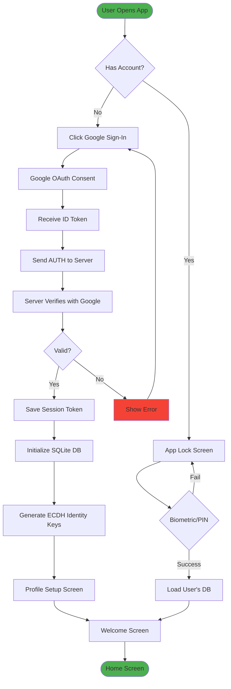
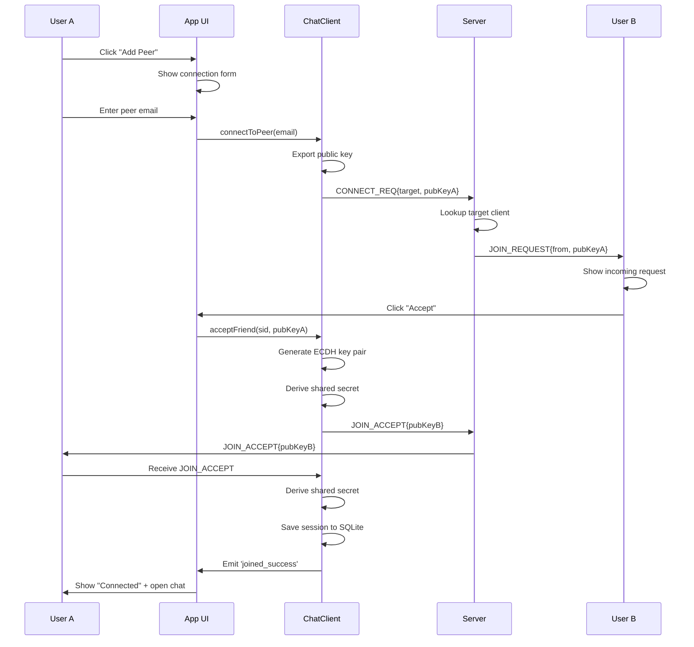
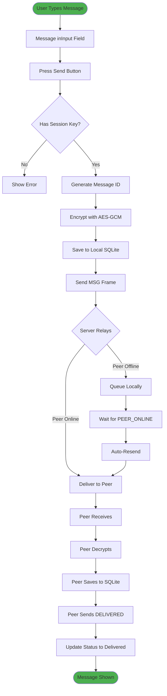
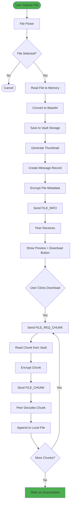
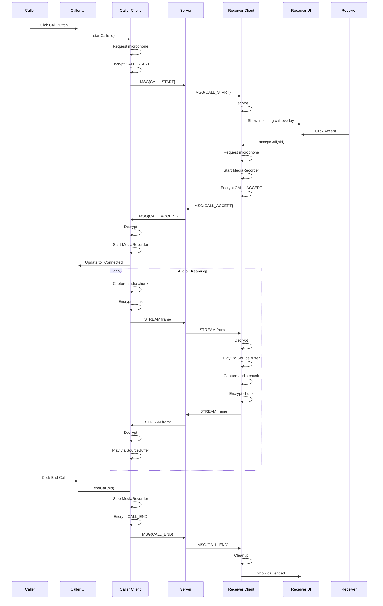
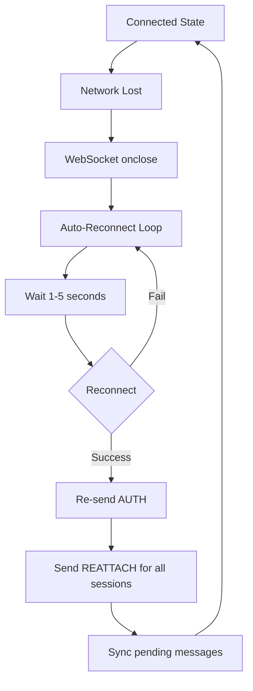

# Application Flow Specifications

This document describes the complete user journeys through the Secure Chat Application, from first-time installation to advanced features.

## 1. Onboarding Flow

### Onboarding Flow Diagram

### Execution Sequence (Onboarding)

1. **App Launch**: User opens the app for the first time
2. **Authentication Check**: App checks `SafeStorage` for existing accounts
3. **Google Sign-In**: User clicks "Sign in with Google"
4. **OAuth Flow**: Google OAuth consent screen appears
5. **Token Exchange**: App receives `id_token` from Google
6. **Server Authentication**: App sends `AUTH` frame to relay server
7. **Token Validation**: Server validates token with Google's API
8. **Session Token**: Server issues HMAC-signed session token
9. **Local Setup**:
   - Create encrypted SQLite database
   - Generate ECDH identity key pair
   - Store keys in secure storage
10. **Profile Setup**: User sets display name and avatar
11. **Welcome Screen**: User sees the main interface

## 2. Peer Session Establishment

### Peer Session Establishment Flow

### Handshake Execution Sequence

1. **Initiate Connection**:
   - User A clicks "Add Peer" button
   - Connection setup form appears
   - User A enters User B's email address

2. **Request Transmission**:
   - App generates connection request
   - Exports User A's ECDH public key
   - Sends `CONNECT_REQ` frame to server

3. **Server Routing**:
   - Server looks up User B in `emailToClientId` map
   - If User B is online, forwards request
   - If offline, returns "User not online" error

4. **Peer Notification**:
   - User B receives `JOIN_REQUEST` frame
   - Modal appears showing incoming request
   - Displays: "<user-a@gmail.com> wants to connect"

5. **Accept/Deny Decision**:
   - User B clicks "Accept" or "Deny"
   - If denied, server sends `JOIN_DENIED` to User A

6. **Key Exchange (on Accept)**:
   - User B generates ECDH key pair
   - Derives shared secret using User A's public key
   - Sends `JOIN_ACCEPT` with User B's public key

7. **Session Establishment**:
   - User A receives User B's public key
   - Derives same shared secret
   - Both users now have identical AES-GCM session key

8. **Local Storage**:
   - Session key stored in SQLite `sessions` table
   - Session marked as `online: true`
   - Chat window opens automatically

## 3. Encrypted Message Transmission

### Message Transmission Flow

### Message Delivery Execution Sequence

1. **Message Composition**:
   - User types text in input field
   - App shows typing indicator (local only)

2. **Send Trigger**:
   - User presses Enter or clicks Send button
   - UI calls `ChatClient.sendMessage(sid, text)`

3. **Message Preparation**:
   - Generate UUID for message ID
   - Get current timestamp
   - Create message object: `{t: "MSG", data: {text, id, timestamp}}`

4. **Encryption**:
   - Retrieve session key from memory
   - Generate random 12-byte IV
   - Encrypt message with AES-GCM
   - Prepend IV to ciphertext
   - Base64 encode result

5. **Local Storage**:
   - Insert into SQLite `messages` table
   - Set status = 1 (pending)
   - Set sender = 'me'

6. **Transmission**:
   - Send `MSG` frame to server
   - Frame structure: `{t: "MSG", sid, data: {payload}}`

7. **Server Relay**:
   - Server identifies all clients in session
   - Forwards encrypted payload to peer(s)
   - Server cannot decrypt content

8. **Peer Reception**:
   - Peer receives `MSG` frame
   - Retrieves session key from local storage
   - Decrypts payload
   - Parses JSON

9. **Peer Storage**:
   - Inserts into local SQLite
   - Set sender = 'other'
   - Set status = 2 (delivered)

10. **Delivery Confirmation**:
    - Peer sends `DELIVERED` frame back
    - Sender updates message status in SQLite
    - UI shows checkmark indicator

## 4. Encrypted File Transfer

### File Transfer Flow

### File Transfer Execution Sequence

**Sender Flow**:

1. **File Selection**:
   - User clicks attach button
   - Native file picker opens
   - User selects image/video/document

2. **File Processing**:
   - Read file as Blob
   - Convert to Base64
   - Generate thumbnail (if image/video)

3. **Vault Storage**:
   - Save encrypted Base64 to vault
   - Receive vault filename

4. **Message Creation**:
   - Insert message record into SQLite
   - Type = 'image', 'video', 'audio', or 'file'
   - Create media entry with metadata

5. **Metadata Transmission**:
   - Encrypt file info (name, size, type, thumbnail)
   - Send `FILE_INFO` frame to peer
   - Display in sender's chat immediately

**Receiver Flow**:

1. **Metadata Reception**:
   - Receive `FILE_INFO` frame
   - Decrypt metadata
   - Show preview with thumbnail
   - Display download button

2. **Download Initiation**:
   - User clicks download
   - Send `FILE_REQ_CHUNK` (index=0)

3. **Chunked Transfer**:
   - Sender reads 64KB chunk from vault
   - Encrypts chunk with session key
   - Sends `FILE_CHUNK` frame
   - Receiver appends to local file

4. **Progress Tracking**:
   - Update progress in SQLite
   - Show progress bar in UI
   - Request next chunk

5. **Completion**:
   - Last chunk marked with `isLast: true`
   - Update status to 'downloaded'
   - File ready for viewing/saving

## 5. Encrypted Voice Session

### Voice Session Establishment & Streaming Flow

### Voice Streaming Execution Sequence

1. **Call Initiation**:
   - Caller clicks phone icon
   - App requests microphone permission
   - Encrypt `CALL_START` message
   - Send to peer via server

2. **Incoming Call**:
   - Receiver's app decrypts `CALL_START`
   - Show full-screen call overlay
   - Play ringtone (local)

3. **Call Accept**:
   - Receiver clicks "Accept"
   - Request microphone access
   - Initialize MediaRecorder (Opus codec)
   - Send `CALL_ACCEPT` back

4. **Bidirectional Setup**:
   - Both sides start MediaRecorder
   - Set up MediaSource with SourceBuffer
   - Initialize audio playback element

5. **Audio Streaming**:
   - MediaRecorder emits 50ms chunks
   - Each chunk encrypted with AES-GCM
   - Sent as `STREAM` frame
   - Peer decrypts and appends toSourceBuffer
   - SourceBuffer plays audio continuously

6. **End Call**:
   - Either party clicks "End"
   - Stop MediaRecorder
   - Send `CALL_END` message
   - Clean up audio resources
   - Log call duration

## 6. Account Switching

### Flow

1. User clicks profile icon → "Switch Account"
2. App Lock Screen appears with account list
3. User selects different account
4. App calls `ChatClient.switchAccount(email)`
5. Close current WebSocket connection
6. Load new account's database and keys
7. Re-establish WebSocket with new session token
8. Load sessions and UI refreshes

## 7. Fault Handling & Recovery Flows

### Network Failure & Reconnection

### Peer Offline

- Message queued in local SQLite (status = pending)
- UI shows "grey checkmark" or clock icon
- When `PEER_ONLINE` event received, auto-retry sending
- Update status when delivered

### Invalid Session

- Server responds with `ERROR: "Authentication required"`
- App triggers logout flow
- Clear session token
- Clear session token
- Return to login screen

## 8. Message Deletion

### Flow

1. User right-clicks (desktop) or long-presses (mobile) on a message bubble.
2. User selects **Delete**.
3. **Condition Check**:
   - **If My Message**:
     - App constructs `DELETE` payload.
     - Encrypts and sends to peer via `MSG` frame.
     - Performs **hard delete** locally (DELETE FROM messages).
     - UI removes bubble instantly.
   - **If Peer's Message**:
     - No network action taken.
     - Performs **hard delete** locally.
     - UI removes bubble instantly.

### Backend/Peer Flow (Unsend)

1. Peer receives `DELETE` frame.
2. Basic validation (sender must be message owner).
3. Peer performs **hard delete** locally.
4. UI removes bubble instantly.
