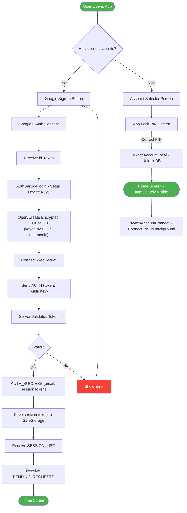
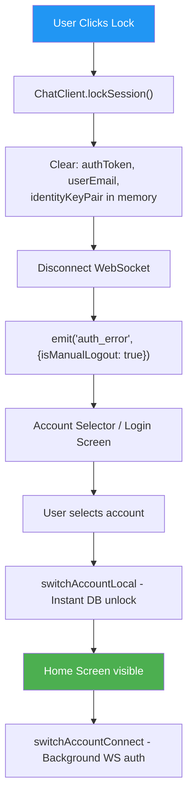
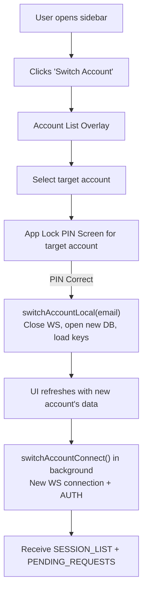
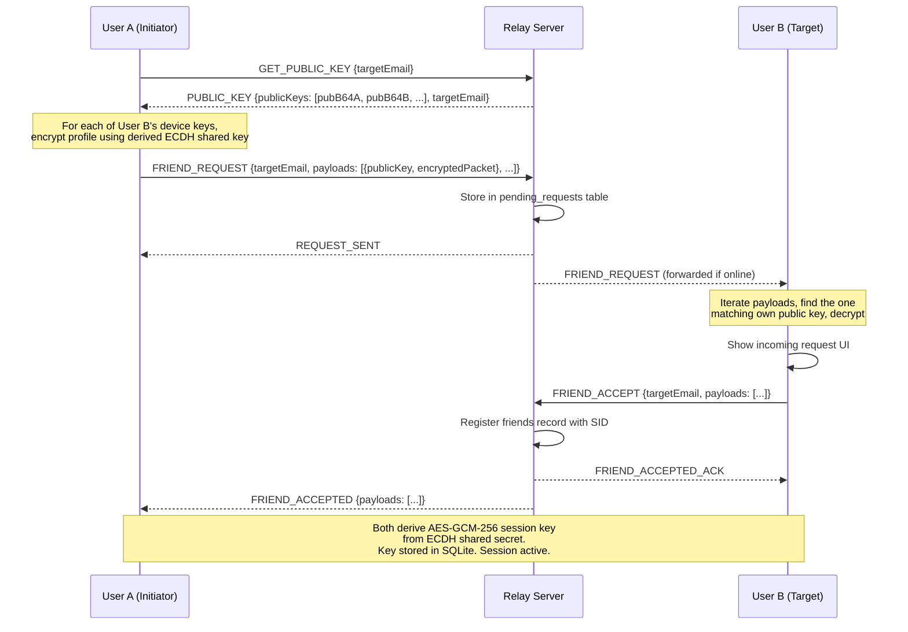
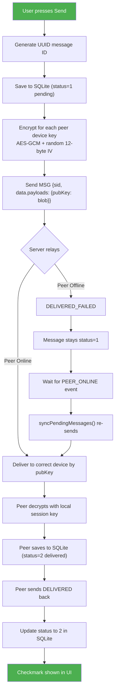
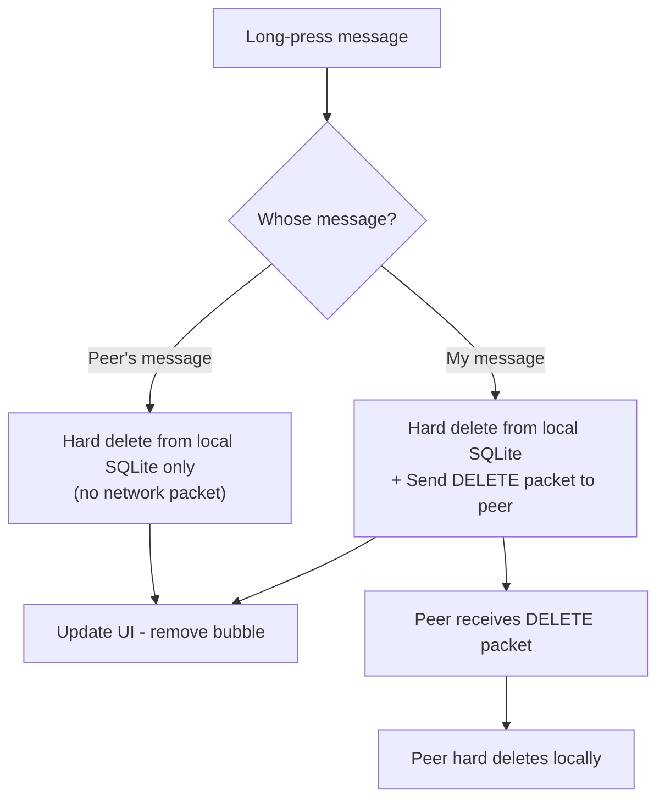
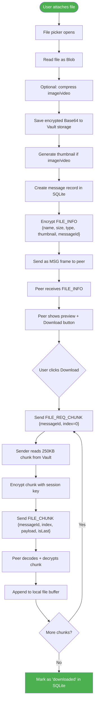
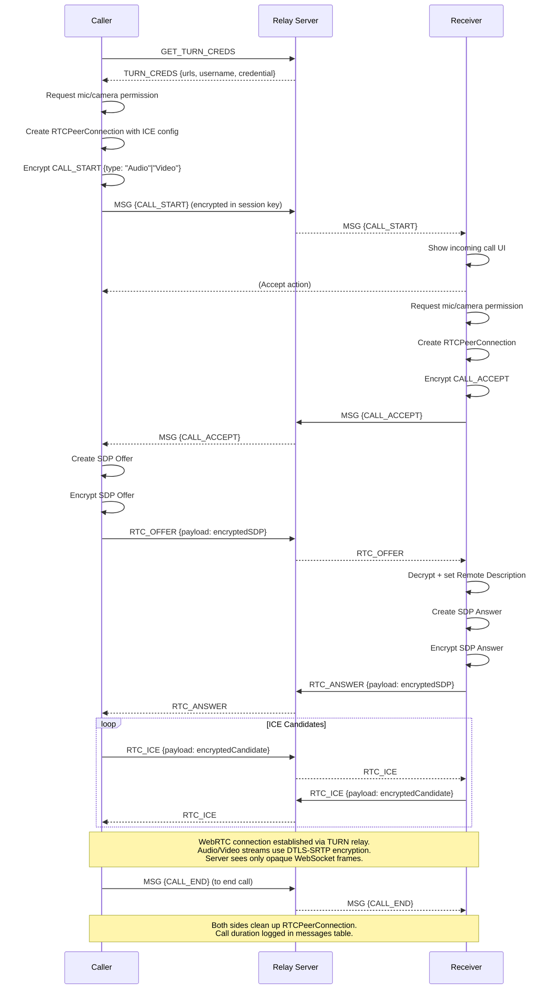
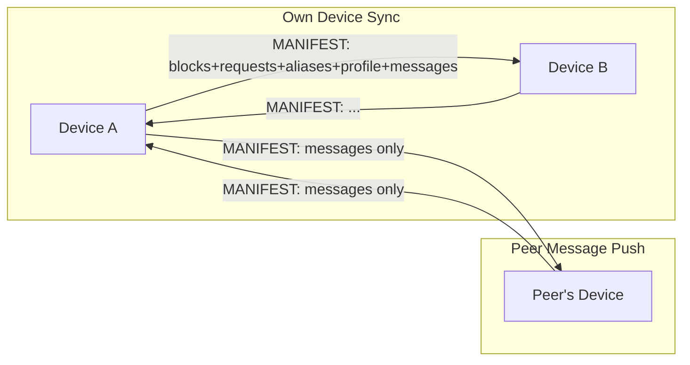
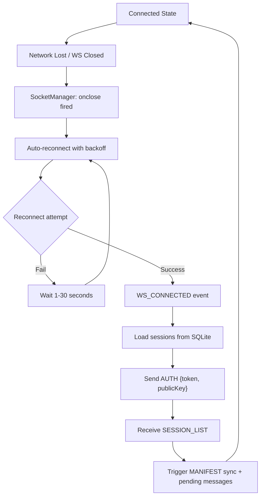

# Application Flow Specifications

This document describes the complete user journeys through the Secure Chat Application (CryptNode), from first-time installation to advanced features.

## Table of Contents

1. [Onboarding & First Login](#1-onboarding--first-login)
2. [App Lock & Session Lock](#2-app-lock--session-lock)
3. [Account Switching (Multi-Account)](#3-account-switching-multi-account)
4. [Peer Session Establishment (Friend Request Flow)](#4-peer-session-establishment-friend-request-flow)
5. [Encrypted Message Transmission](#5-encrypted-message-transmission)
6. [Message Editing & Deletion](#6-message-editing--deletion)
7. [Encrypted File Transfer](#7-encrypted-file-transfer)
8. [Encrypted Voice & Video Calls (WebRTC)](#8-encrypted-voice--video-calls-webrtc)
9. [Cross-Device Sync (MANIFEST Protocol)](#9-cross-device-sync-manifest-protocol)
10. [Fault Handling & Recovery](#10-fault-handling--recovery)
11. [Block & Unfriend Flows](#11-block--unfriend-flows)

---

## 1. Onboarding & First Login

### Flow Diagram


```mermaid
flowchart TD
    START([User Opens App]) --> CHECK{Has stored accounts?}
    CHECK -->|No| GOOGLE[Google Sign-In Button]
    CHECK -->|Yes| ACCOUNTS[Account Selector Screen]

    GOOGLE --> OAUTH[Google OAuth Consent]
    OAUTH --> TOKEN[Receive id_token]
    TOKEN --> SETUP[AuthService.login - Setup Device Keys]
    SETUP --> DBINIT["Open/Create Encrypted SQLite DB\n(keyed by BIP39 mnemonic)"]
    DBINIT --> WSCONN[Connect WebSocket]
    WSCONN --> AUTH["Send AUTH {token, publicKey}"]
    AUTH --> VERIFY[Server Validates Token]
    VERIFY --> SUCCESS{Valid?}

    SUCCESS -->|Yes| AUTHSUCCESS["AUTH_SUCCESS {email, sessionToken}"]
    SUCCESS -->|No| ERROR[Show Error]
    ERROR --> GOOGLE

    AUTHSUCCESS --> SAVETOKEN[Save session token to SafeStorage]
    SAVETOKEN --> SESSLIST[Receive SESSION_LIST]
    SESSLIST --> PENDINGREQ[Receive PENDING_REQUESTS]
    PENDINGREQ --> HOME([Home Screen])

    ACCOUNTS --> LOCK[App Lock PIN Screen]
    LOCK -->|Correct PIN| PHASE1["switchAccountLocal - Unlock DB"]
    PHASE1 --> HOME2([Home Screen - Immediately Visible])
    HOME2 --> BGCONN["switchAccountConnect - Connect WS in background"]

    style START fill:#4CAF50,color:#fff
    style HOME fill:#4CAF50,color:#fff
    style HOME2 fill:#4CAF50,color:#fff
    style ERROR fill:#f44336,color:#fff
```

### Execution Sequence (First-Time Login)

1. App checks `SafeStorage` for existing accounts
2. User taps "Sign in with Google" → Google OAuth consent screen
3. App receives `id_token` from Google
4. `AuthService.login(id_token)`:
   - Generates a new ECDH P-256 identity key pair (or loads existing)
   - Generates a 12-word BIP39 mnemonic as SQLite encryption key
   - Opens the user's encrypted SQLite database
   - Connects WebSocket to relay server
5. On `WS_CONNECTED`: loads sessions from SQLite, sends `AUTH { token, publicKey }`
6. Server validates token, issues HMAC-signed session token
7. Client receives `AUTH_SUCCESS`, saves new session token
8. Server pushes `SESSION_LIST` (ongoing sessions) and `PENDING_REQUESTS` (stored friend requests)
9. Home screen renders with session list

### Returning User (Account Selector)

1. User opens app → Account Selector shows all saved accounts
2. User taps an account → App Lock PIN screen appears
3. User enters PIN → `switchAccountLocal(email)` (Phase 1):
   - Validates session token from `SafeStorage`
   - Loads identity keys
   - Opens SQLite database
   - UI becomes interactive **immediately**
4. `switchAccountConnect(email, ...)` runs in background (Phase 2):
   - Connects WebSocket
   - Authenticates with server
   - Loads sessions and pending requests

---

## 2. App Lock & Session Lock

### App Lock vs. Logout Distinction

| Action | Clears Session Token | Disconnects WS | Returns to Login |
|--------|---------------------|----------------|-----------------|
| **Lock Session** | ❌ No | ✅ Yes | ✅ Yes (Account Selector) |
| **Logout** | ✅ Yes | ✅ Yes | ✅ Yes (Login Screen) |
| **Delete Account** | ✅ Yes | ✅ Yes | ✅ Yes (Login Screen) |

### Session Lock Flow


```mermaid
flowchart TD
    USER[User Clicks Lock] --> LOCK["ChatClient.lockSession()"]
    LOCK --> CLEAR["Clear: authToken, userEmail,\nidentityKeyPair in memory"]
    CLEAR --> DISC[Disconnect WebSocket]
    DISC --> EMIT["emit('auth_error', {isManualLogout: true})"]
    EMIT --> SELECTOR[Account Selector / Login Screen]
    SELECTOR --> RESUME[User selects account]
    RESUME --> PHASE1["switchAccountLocal - Instant DB unlock"]
    PHASE1 --> HOME[Home Screen visible]
    HOME --> PHASE2["switchAccountConnect - Background WS auth"]

    style USER fill:#2196F3,color:#fff
    style HOME fill:#4CAF50,color:#fff
```

**Key behavior**: `lockSession()` does **not** wipe the stored session token. The user can unlock instantly with their PIN without re-authenticating with Google.

### App Lock PIN Screen

The App Lock screen is shown when:
- The user manually clicks "Lock" from the sidebar
- The user selects a different account from the account selector
- The app detects it was backgrounded (optional, platform-dependent)

The PIN is verified locally (no network call). On success, Phase 1 local unlock runs immediately.

---

## 3. Account Switching (Multi-Account)

### Flow


```mermaid
flowchart TD
    SIDEBAR[User opens sidebar] --> SWITCH[Clicks 'Switch Account']
    SWITCH --> SELECTOR[Account List Overlay]
    SELECTOR --> SELECT[Select target account]
    SELECT --> LOCK[App Lock PIN Screen for target account]
    LOCK -->|PIN Correct| PHASE1["switchAccountLocal(email)\nClose WS, open new DB, load keys"]
    PHASE1 --> UI[UI refreshes with new account's data]
    UI --> PHASE2["switchAccountConnect() in background\nNew WS connection + AUTH"]
    PHASE2 --> SYNC[Receive SESSION_LIST + PENDING_REQUESTS]
```

**Key Design**: The two-phase switch pattern (`switchAccountLocal` then `switchAccountConnect`) ensures the user sees their data instantly without waiting for network authentication.

---

## 4. Peer Session Establishment (Friend Request Flow)

### Handshake Sequence


```mermaid
sequenceDiagram
    participant UA as User A (Initiator)
    participant S as Relay Server
    participant UB as User B (Target)

    UA->>S: GET_PUBLIC_KEY {targetEmail}
    S-->>UA: PUBLIC_KEY {publicKeys: [pubB64A, pubB64B, ...], targetEmail}

    note over UA: For each of User B's device keys,<br/>encrypt profile using derived ECDH shared key

    UA->>S: FRIEND_REQUEST {targetEmail, payloads: [{publicKey, encryptedPacket}, ...]}
    S->>S: Store in pending_requests table
    S-->>UA: REQUEST_SENT
    S-->>UB: FRIEND_REQUEST (forwarded if online)

    note over UB: Iterate payloads, find the one<br/>matching own public key, decrypt

    UB->>UB: Show incoming request UI
    UB->>S: FRIEND_ACCEPT {targetEmail, payloads: [...]}
    S->>S: Register friends record with SID
    S-->>UB: FRIEND_ACCEPTED_ACK
    S-->>UA: FRIEND_ACCEPTED {payloads: [...]}

    note over UA,UB: Both derive AES-GCM-256 session key<br/>from ECDH shared secret.<br/>Key stored in SQLite. Session active.
```

### Detailed Handshake Steps

1. **Initiate**: User A enters User B's email → `SessionService.connectToPeer(email)` → sends `GET_PUBLIC_KEY`
2. **Key Retrieval**: Server returns all of User B's registered device public keys
3. **Friend Request**: For each remote public key, User A:
   - Derives a temporary AES-GCM key via ECDH
   - Encrypts their own profile `{ email, name, avatar, nameVersion, avatarVersion, timestamp }`
   - Packages `{ publicKey, encryptedPacket }` into a `payloads` array
4. **Offline Delivery**: If User B is offline, the server stores the payloads in SQLite for delivery on next login
5. **Request Receipt**: User B's device finds its payload (by matching its public key), decrypts the profile, stores in `pending_requests` table, shows modal
6. **Accept Decision**:
   - **Accept**: User B sends `FRIEND_ACCEPT` with their own encrypted profile payloads for each of User A's device keys
   - **Deny**: User B sends `FRIEND_DENY`. Server queues `FRIEND_DENIED` notification for User A
7. **Session Finalization** (`finalizeSession`):
   - For each new public key, derive AES-GCM-256 session key from ECDH shared secret
   - Store keys as JWK in SQLite `sessions` table
   - Initialize `WorkerManager` with the keys
   - Emit `session_created`
8. **SID Derivation**: Session ID = `SHA-256(lowerEmail1 + ":" + lowerEmail2)` (sorted alphabetically), ensuring determinism across both devices

### Dynamic Key Rotation

If a peer reinstalls the app (changing their public key), the server sends updated keys via `SESSION_LIST`. `SessionService.handleSessionList()` detects the key change and automatically re-derives all session keys — no manual reconnection needed.

---

## 5. Encrypted Message Transmission

### Message Flow


```mermaid
flowchart TD
    SEND[User presses Send] --> GENID[Generate UUID message ID]
    GENID --> SAVE["Save to SQLite (status=1 pending)"]
    SAVE --> ENCRYPT["Encrypt for each peer device key\nAES-GCM + random 12-byte IV"]
    ENCRYPT --> TRANSMIT["Send MSG {sid, data.payloads: {pubKey: blob}}"]

    TRANSMIT --> RELAY{Server relays}
    RELAY -->|Peer Online| DELIVER["Deliver to correct device by pubKey"]
    RELAY -->|Peer Offline| DFAILED[DELIVERED_FAILED]

    DELIVER --> PDECRYPT[Peer decrypts with local session key]
    PDECRYPT --> PSAVE["Peer saves to SQLite (status=2 delivered)"]
    PSAVE --> ACK["Peer sends DELIVERED back"]

    ACK --> UPDATE["Update status to 2 in SQLite"]
    UPDATE --> UI[Checkmark shown in UI]

    DFAILED --> QUEUE["Message stays status=1"]
    QUEUE --> WAIT[Wait for PEER_ONLINE event]
    WAIT --> RETRY["syncPendingMessages() re-sends"]
    RETRY --> DELIVER

    style SEND fill:#4CAF50,color:#fff
    style UI fill:#4CAF50,color:#fff
```

### Inner Message Payload Format

The encrypted payload, when decrypted, contains an inner JSON object:

```json
{
  "t": "MSG",
  "data": {
    "text": "Hello, world!",
    "id": "uuid-1234",
    "timestamp": 1704067200000,
    "replyTo": { "id": "...", "text": "..." }
  }
}
```

The `t` field inside the decrypted payload is the **inner message type** and can be: `MSG`, `FILE_INFO`, `FILE_REQ_CHUNK`, `FILE_CHUNK`, `CALL_START`, `CALL_ACCEPT`, `CALL_END`, `CALL_BUSY`, `DELETE`, `EDIT`, `REACTION`, `MANIFEST`, `PROFILE_VERSION`, `GET_PROFILE`, `PROFILE_DATA`, `SYNC_CALL_ACCEPT`, `SYNC_CALL_END`.

---

## 6. Message Editing & Deletion

### Edit Message Flow

1. User right-clicks (desktop) or long-presses (mobile) a message they sent → taps "Edit"
2. Input field is pre-filled with original text
3. User modifies text and confirms
4. `MessageService.editMessage(sid, messageId, newText)`:
   - Updates text in local SQLite
   - Encrypts `{ t: "EDIT", data: { id, text, timestamp } }` and sends to peer
5. Peer receives `EDIT` inner packet, updates their local SQLite
6. UI updates message bubble (may show "(edited)" label)

### Delete Message Flow


```mermaid
flowchart TD
    LONGPRESS[Long-press message] --> CHECK{Whose message?}

    CHECK -->|My message| MYDELETE["Hard delete from local SQLite\n+ Send DELETE packet to peer"]
    MYDELETE --> UPDATE["Update UI - remove bubble"]
    MYDELETE --> PEERRECV[Peer receives DELETE packet]
    PEERRECV --> PEERDELETE[Peer hard deletes locally]

    CHECK -->|Peer's message| LOCALONLY["Hard delete from local SQLite only\n(no network packet)"]
    LOCALONLY --> UPDATE
```

**Important**: Both delete paths are **hard deletes** — no "message deleted" placeholder is shown.

### Delete Chat Flow

- User opens a session → options menu → "Delete Chat"
- `ChatClient.deleteChat(sid)` → `MessageService.deleteChatLocally(sid)` → `DELETE FROM messages WHERE sid = ?`
- Session entry in SQLite is preserved, so the contact remains in the list without messages
- No network packet is sent; this is purely local

---

## 7. Encrypted File Transfer

### File Transfer Flow


```mermaid
flowchart TD
    START([User attaches file]) --> PICKER[File picker opens]
    PICKER --> READ[Read file as Blob]
    READ --> COMPRESS[Optional: compress image/video]
    COMPRESS --> VAULT[Save encrypted Base64 to Vault storage]
    VAULT --> THUMB[Generate thumbnail if image/video]
    THUMB --> MSGDB[Create message record in SQLite]
    MSGDB --> META["Encrypt FILE_INFO\n{name, size, type, thumbnail, messageId}"]
    META --> SEND["Send as MSG frame to peer"]
    SEND --> PEER[Peer receives FILE_INFO]
    PEER --> PREVIEW[Peer shows preview + Download button]

    PREVIEW --> WAIT{User clicks Download}
    WAIT --> REQ["Send FILE_REQ_CHUNK {messageId, index=0}"]

    REQ --> READCHUNK["Sender reads 250KB chunk from Vault"]
    READCHUNK --> ENCCHUNK[Encrypt chunk with session key]
    ENCCHUNK --> SENDCHUNK["Send FILE_CHUNK {messageId, index, payload, isLast}"]
    SENDCHUNK --> DECODE[Peer decodes + decrypts chunk]
    DECODE --> APPEND[Append to local file buffer]
    APPEND --> MORE{More chunks?}
    MORE -->|Yes| REQ
    MORE -->|No| COMPLETE["Mark as 'downloaded' in SQLite"]

    style START fill:#4CAF50,color:#fff
    style COMPLETE fill:#4CAF50,color:#fff
```

**Chunk size**: 250KB per chunk (~256,000 bytes). Files are never fully loaded into RAM on the sender side — streamed from Vault → encrypt → send.

---

## 8. Encrypted Voice & Video Calls (WebRTC)

### Call Flow


```mermaid
sequenceDiagram
    participant Caller
    participant Server as Relay Server
    participant Receiver

    Caller->>Server: GET_TURN_CREDS
    Server-->>Caller: TURN_CREDS {urls, username, credential}

    Caller->>Caller: Request mic/camera permission
    Caller->>Caller: Create RTCPeerConnection with ICE config
    Caller->>Caller: Encrypt CALL_START {type: "Audio"|"Video"}
    Caller->>Server: MSG {CALL_START} (encrypted in session key)
    Server-->>Receiver: MSG {CALL_START}

    Receiver->>Receiver: Show incoming call UI
    Receiver-->>Caller: (Accept action)
    Receiver->>Receiver: Request mic/camera permission
    Receiver->>Receiver: Create RTCPeerConnection
    Receiver->>Receiver: Encrypt CALL_ACCEPT
    Receiver->>Server: MSG {CALL_ACCEPT}
    Server-->>Caller: MSG {CALL_ACCEPT}

    Caller->>Caller: Create SDP Offer
    Caller->>Caller: Encrypt SDP Offer
    Caller->>Server: RTC_OFFER {payload: encryptedSDP}
    Server-->>Receiver: RTC_OFFER

    Receiver->>Receiver: Decrypt + set Remote Description
    Receiver->>Receiver: Create SDP Answer
    Receiver->>Receiver: Encrypt SDP Answer
    Receiver->>Server: RTC_ANSWER {payload: encryptedSDP}
    Server-->>Caller: RTC_ANSWER

    loop ICE Candidates
        Caller->>Server: RTC_ICE {payload: encryptedCandidate}
        Server-->>Receiver: RTC_ICE
        Receiver->>Server: RTC_ICE {payload: encryptedCandidate}
        Server-->>Caller: RTC_ICE
    end

    note over Caller,Receiver: WebRTC connection established via TURN relay.<br/>Audio/Video streams use DTLS-SRTP encryption.<br/>Server sees only opaque WebSocket frames.

    Caller->>Server: MSG {CALL_END} (to end call)
    Server-->>Receiver: MSG {CALL_END}
    note over Caller,Receiver: Both sides clean up RTCPeerConnection.<br/>Call duration logged in messages table.
```

### Multi-Device Call Awareness

When a call is accepted or ended on one device, the `MessageService.broadcastSyncCallAction()` sends a `SYNC_CALL_ACCEPT` or `SYNC_CALL_END` inner packet to the user's **own linked devices** so they can dismiss incoming call notifications.

---

## 9. Cross-Device Sync (MANIFEST Protocol)

### MANIFEST Sync Overview


```mermaid
flowchart LR
    subgraph "Own Device Sync"
        D1[Device A] -->|MANIFEST: blocks+requests+aliases+profile+messages| D2[Device B]
        D2 -->|MANIFEST: ...| D1
    end
    subgraph "Peer Message Push"
        D1 -->|MANIFEST: messages only| PeerDevice[Peer's Device]
        PeerDevice -->|MANIFEST: messages only| D1
    end
```

### When MANIFEST Is Triggered

| Trigger | Recipients | Sections Sent |
|---------|-----------|---------------|
| `SESSION_LIST` received on login | Own devices + all online peers | Full (own) + messages (peers) |
| `PEER_ONLINE` event | Own devices + that peer | Full (own) + messages (peer) |
| Message sent/received | Own devices | Full |
| Block / unblock action | Own devices | Full |
| Profile updated | Own devices | Full |
| New session created | New peer | Messages only |

### MANIFEST Payload Structure

```json
{
  "t": "MSG",
  "data": {
    "type": "MANIFEST",
    "manifest": {
      "blocks": [
        { "email": "blocked@example.com", "action": "block", "timestamp": 1704067200000 },
        { "email": "unblocked@example.com", "action": "unblock", "timestamp": 1704067300000 }
      ],
      "requests": [
        { "email": "peer@example.com", "name": "...", "avatar": "...", "publicKey": "...", "senderHash": "...", "action": "pending", "timestamp": 1704067200000 }
      ],
      "aliases": [
        { "sid": "...", "aliasName": "Work Friend", "aliasAvatar": "", "timestamp": 1704067200000 }
      ],
      "profile": {
        "name": "Yog Mehta", "avatar": "data:image/...", "nameVersion": 2, "avatarVersion": 1
      },
      "messages": [
        { "id": "...", "sid": "...", "sender": "me", "text": "...", "timestamp": ... }
      ]
    }
  }
}
```

### Merge Strategy

Each section is merged independently:

| Section | Merge Logic |
|---------|-------------|
| `blocks` | Compare `timestamp` — newer wins (supports both block AND unblock tombstones) |
| `requests` | Compare `timestamp` — newer wins |
| `aliases` | `alias_timestamp` column guards against applying older updates |
| `profile` | Highest `nameVersion` / `avatarVersion` wins |
| `messages` | `INSERT OR IGNORE` by message ID — safe to receive duplicates |

---

## 10. Fault Handling & Recovery

### Network Disconnect & Reconnection


```mermaid
flowchart TD
    CONNECTED[Connected State] --> DISC[Network Lost / WS Closed]
    DISC --> DETECT["SocketManager: onclose fired"]
    DETECT --> RETRY[Auto-reconnect with backoff]
    RETRY --> ATTEMPT{Reconnect attempt}
    ATTEMPT -->|Fail| WAIT[Wait 1-30 seconds]
    WAIT --> RETRY
    ATTEMPT -->|Success| WS_CONN["WS_CONNECTED event"]
    WS_CONN --> LOADS[Load sessions from SQLite]
    LOADS --> REAUTH["Send AUTH {token, publicKey}"]
    REAUTH --> SESSLIST[Receive SESSION_LIST]
    SESSLIST --> SYNC[Trigger MANIFEST sync + pending messages]
    SYNC --> CONNECTED
```

### Session Token Expiry

- Server responds with `ERROR { message: "Auth failed" }` or `"Authentication required"`
- `ChatClient.handleFrame` catches auth errors and calls `authService.logout()`
- User is returned to login screen with a notification

### Peer Offline Message Queuing

- Message sent while peer is offline receives `DELIVERED_FAILED` from server
- Message stays `status = 1` (pending) in SQLite
- When `PEER_ONLINE` event fires, `syncPendingMessages()` re-queries all `status=1` messages and retries
- Also on `SESSION_LIST` receipt: `coordinateSync(sid)` pushes missed messages via MANIFEST

---

## 11. Block & Unfriend Flows

### Block Flow

1. User opens contact profile → taps "Block"
2. `SessionService.blockUser(email)`:
   - Sends `BLOCK_USER { targetEmail }` to server
   - Inserts email and hash into local `blocked_users` table
   - Clears any pending requests from that user
   - Emits `block_list_changed`
3. `MessageService.broadcastManifestToOwnDevices()` propagates the block to own linked devices via the `blocks` section with `action: "block"`
4. Server sends `USER_BLOCKED_EVENT` to the peer (or stores for offline delivery)

### Unblock Flow

- Unblocking is **local-only** — no network packet is sent to the server
- `SessionService.unblockUser(email)` removes entries from local `blocked_users`
- `broadcastManifestToOwnDevices()` propagates an `action: "unblock"` tombstone to own devices

### Unfriend Flow

1. User opens contact profile → taps "Remove Connection"
2. `ChatClient.removeConnection(targetHash, sid)`:
   - Sends `UNFRIEND { targetHash }` to server
   - Marks session as offline and not connected in memory
   - Server relays `UNFRIENDED { senderHash }` to the peer
3. The session record remains in SQLite (for chat history) but is marked inactive
4. If an active call is in progress, it ends automatically

### Inbound Unfriend / Block

- `UNFRIENDED { senderHash }` frame: Client identifies all sessions matching that peer hash and calls `removeConnection` for each
- `SYNC_UNFRIEND { targetHash, sid }`: Relayed from own devices to sync the unfriend action
- `SYNC_BLOCK { targetHash }`: Own-device sync for block actions from another device
