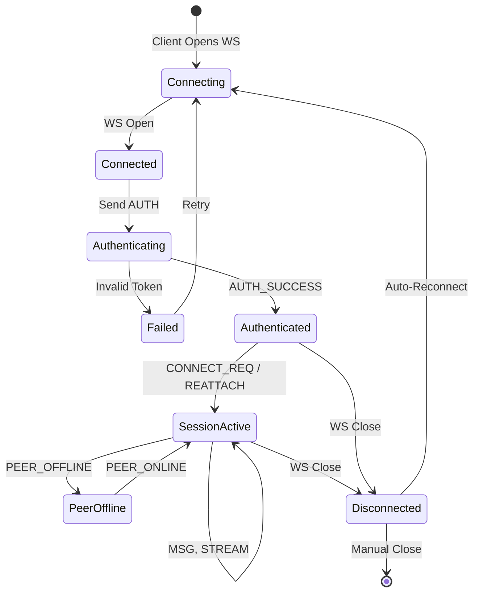

# WebSocket Protocol Specification

This document defines the complete WebSocket protocol used for communication between clients and the relay server.

## Protocol Overview

- **Transport**: WebSocket (RFC 6455)
- **Encoding**: JSON
- **Encryption**: Payload-level AES-GCM (E2E), TLS for transport (production)
- **Frame Structure**: All messages follow a standardized frame format

## Frame Structure

All WebSocket messages use this JSON structure:

```typescript
interface Frame {
  t: string; // Frame type (e.g., "AUTH", "MSG", "CONNECT_REQ")
  sid?: string; // Session ID (optional, used for session-specific frames)
  data?: any; // Frame-specific payload
}
```

**Example**:

```json
{
  "t": "MSG",
  "sid": "1704067200000_a3f7d2e1",
  "data": {
    "payload": "YWJjZGVmZ2hpams..." // Base64 encrypted content
  }
}
```

## Frame Types Reference Table

| Frame Type         | Direction       | Purpose                        | Requires Auth | Requires SID |
| ------------------ | --------------- | ------------------------------ | ------------- | ------------ |
| `AUTH`             | Client → Server | Authenticate with Google token | No            | No           |
| `AUTH_SUCCESS`     | Server → Client | Confirm authentication         | N/A           | No           |
| `CONNECT_REQ`      | Client → Server | Request connection to peer     | Yes           | No           |
| `JOIN_REQUEST`     | Server → Client | Notify of incoming connection  | N/A           | Yes          |
| `JOIN_ACCEPT`      | Client → Server | Accept connection request      | Yes           | Yes          |
| `JOIN_DENY`        | Client → Server | Reject connection request      | Yes           | Yes          |
| `JOIN_DENIED`      | Server → Client | Notify connection was rejected | N/A           | Yes          |
| `REATTACH`         | Client → Server | Reconnect to existing session  | Yes           | Yes          |
| `MSG`              | Bidirectional   | Encrypted message/command      | Yes           | Yes          |
| `RTC_OFFER`        | Bidirectional   | WebRTC SDP Offer               | Yes           | Yes          |
| `RTC_ANSWER`       | Bidirectional   | WebRTC SDP Answer              | Yes           | Yes          |
| `RTC_ICE`          | Bidirectional   | WebRTC ICE Candidate           | Yes           | Yes          |
| `PEER_ONLINE`      | Server → Client | Notify peer came online        | N/A           | Yes          |
| `PEER_OFFLINE`     | Server → Client | Notify peer went offline       | N/A           | Yes          |
| `DELIVERED`        | Server → Client | Confirm message delivery       | N/A           | Yes          |
| `DELIVERED_FAILED` | Server → Client | Message delivery failed        | N/A           | Yes          |
| `ERROR`            | Server → Client | Error notification             | N/A           | No           |
| `PING`             | Server → Client | Heartbeat                      | N/A           | No           |

## Frame Type Specifications

### 1. Authentication Frames

#### `AUTH` (Client → Server)

**Purpose**: Authenticate with the relay server using Google ID token or session token.

**Request**:

```json
{
  "t": "AUTH",
  "data": {
    "token": "eyJhbGciOiJSUzI1NiIsImtpZCI6Ij..." // Google ID token or session token
  }
}
```

**Server Logic**:

1. Check if token starts with `"sess:"` (session token) or is Google ID token
2. Validate token (HMAC for session, Google API for ID token)
3. Extract email from token
4. Check if email is already connected on another client
5. If yes, reject new client
6. If no, register client and respond with `AUTH_SUCCESS`

#### `AUTH_SUCCESS` (Server → Client)

**Purpose**: Confirm successful authentication and provide session token.

**Response**:

```json
{
  "t": "AUTH_SUCCESS",
  "data": {
    "email": "user@example.com",
    "token": "sess:1735689600:user@example.com:a3d5f7e9..." // HMAC session token
  }
}
```

**Client Action**:

- Save session token to SecureStorage
- Initialize/switch SQLite database
- Load identity keys
- Emit `auth_success` event to UI

### 2. Connection Establishment Frames

#### `CONNECT_REQ` (Client → Server)

**Purpose**: Request to connect with another user by email.

**Request**:

```json
{
  "t": "CONNECT_REQ",
  "data": {
    "targetEmail": "peer@example.com",
    "publicKey": "YjY3ZDlmOWUyZmQ0..." // Base64-encoded ECDH public key
  }
}
```

**Server Logic**:

1. Log connection attempt (hashed emails)
2. Lookup target email in `emailToClientId` map
3. If not found, respond with `ERROR: "User not online"`
4. If found, generate new Session ID
5. Create session with requester as first member
6. Forward request to target as `JOIN_REQUEST`

#### `JOIN_REQUEST` (Server → Client)

**Purpose**: Notify user of incoming connection request.

**Notification**:

```json
{
  "t": "JOIN_REQUEST",
  "sid": "1704067200000_a3f7d2e1",
  "data": {
    "publicKey": "YjY3ZDlmOWUyZmQ0...",
    "email": "requester@example.com"
  }
}
```

**Client Action**:

- Show modal with "X wants to connect"
- User chooses Accept or Deny

#### `JOIN_ACCEPT` (Client → Server)

**Purpose**: Accept incoming connection and complete key exchange.

**Request**:

```json
{
  "t": "JOIN_ACCEPT",
  "sid": "1704067200000_a3f7d2e1",
  "data": {
    "publicKey": "ZGVmZ2hpamtsbW5v..." // Acceptor's ECDH public key
  }
}
```

**Server Logic**:

1. Add accepting client to session
2. Forward `JOIN_ACCEPT` to requester

**Both Clients**:

- Derive shared secret using ECDH
- Generate AES-GCM session key
- Store in local SQLite
- Open chat window

#### `JOIN_DENY` (Client → Server)

**Purpose**: Reject incoming connection request.

**Request**:

```json
{
  "t": "JOIN_DENY",
  "sid": "1704067200000_a3f7d2e1"
}
```

**Server Logic**:

- Forward `JOIN_DENIED` to requester
- Optionally destroy session

#### `JOIN_DENIED` (Server → Client)

**Notification**:

```json
{
  "t": "JOIN_DENIED",
  "sid": "1704067200000_a3f7d2e1"
}
```

**Client Action**:

- Show "Connection rejected" notification
- Remove session from UI

### 3. Session Management Frames

#### `REATTACH` (Client → Server)

**Purpose**: Reconnect to an existing session after disconnect/restart.

**Request**:

```json
{
  "t": "REATTACH",
  "sid": "1704067200000_a3f7d2e1"
}
```

**Server Logic**:

1. Check if session exists in memory
2. If not, create new session with this client
3. Add client to session
4. Notify other clients via `PEER_ONLINE`

**Use Case**: App restart, network reconnection

#### `PEER_ONLINE` (Server → Client)

**Purpose**: Notify that a peer in the session came online.

**Notification**:

```json
{
  "t": "PEER_ONLINE",
  "sid": "1704067200000_a3f7d2e1"
}
```

**Client Action**:

- Update UI (show "online" indicator)
- Trigger pending message sync

#### `PEER_OFFLINE` (Server → Client)

**Purpose**: Notify that a peer disconnected.

**Notification**:

```json
{
  "t": "PEER_OFFLINE",
  "sid": "1704067200000_a3f7d2e1"
}
```

**Client Action**:

- Update UI (show "offline" indicator)
- Stop auto-retry for pending messages

### 4. Messaging Frames

#### `MSG` (Bidirectional)

**Purpose**: Send encrypted message or command.

**Client → Server**:

```json
{
  "t": "MSG",
  "sid": "1704067200000_a3f7d2e1",
  "data": {
    "payload": "iv+ciphertext in Base64" // Encrypted with session AES key
  }
}
```

**Server Logic**:

1. Ensure session exists (create if needed)
2. Add sender to session if not already present
3. Relay `payload` to all other clients in session
4. If delivery successful, respond with `DELIVERED`
5. If no recipients, respond with `DELIVERED_FAILED`

**Decrypted Payload Types**:

The payload, when decrypted, contains a JSON object with its own type:

```typescript
// Text message
{
  "t": "MSG",
  "data": {
    "text": "Hello, world!",
    "id": "uuid-1234",
    "timestamp": 1704067200000,
    "replyTo": {...}  // Optional
  }
}

// File metadata
{
  "t": "FILE_INFO",
  "data": {
    "name": "document.pdf",
    "size": 1048576,
    "type": "application/pdf",
    "thumbnail": "data:image/png;base64,...",
    "messageId": "uuid-5678"
  }
}

// File chunk request
{
  "t": "FILE_REQ_CHUNK",
  "data": {
    "messageId": "uuid-5678",
    "chunkIndex": 0
  }
}

// File chunk response
{
  "t": "FILE_CHUNK",
  "data": {
    "messageId": "uuid-5678",
    "chunkIndex": 0,
    "payload": "base64-encoded-data",
    "isLast": false
  }
}

// Call signaling
{
  "t": "CALL_START",
  "data": {
    "type": "Audio"
  }
}

{
  "t": "CALL_ACCEPT"
}

{
  "t": "CALL_END"
}

{
  "t": "CALL_BUSY"
}

// Profile sync
{
  "t": "PROFILE_VERSION",
  "data": {
    "name_version": 2,
    "avatar_version": 1
  }
}

{
  "t": "GET_PROFILE"
}

{
  "t": "PROFILE_DATA",
  "data": {
    "name": "Yog Mehta",
    "avatar": "data:image/png;base64,...",
    "name_version": 2,
    "avatar_version": 1
  }
}

// Message Deletion
{
  "t": "MSG",
  "data": {
    "type": "DELETE",
    "id": "uuid-1234",
    "timestamp": 1704067200000
  }
}
```

#### `DELIVERED` (Server → Client)

**Purpose**: Confirm message was delivered to peer.

**Notification**:

```json
{
  "t": "DELIVERED",
  "sid": "1704067200000_a3f7d2e1"
}
```

**Client Action**:

- Update message status in SQLite (status = 2)
- Show checkmark in UI

#### `DELIVERED_FAILED` (Server → Client)

**Purpose**: Notify that message could not be delivered (no online peers).

**Notification**:

```json
{
  "t": "DELIVERED_FAILED",
  "sid": "1704067200000_a3f7d2e1"
}
```

**Client Action**:

- Keep message in pending state
- Retry when `PEER_ONLINE` received

### 5. WebRTC Signaling Frames

#### `RTC_OFFER` (Bidirectional)

**Purpose**: Send WebRTC Session Description Protocol (SDP) offer.

**Frame**:

```json
{
  "t": "RTC_OFFER",
  "sid": "1704067200000_a3f7d2e1",
  "data": {
    "payload": "encrypted_sdp_offer_json"
  }
}
```

#### `RTC_ANSWER` (Bidirectional)

**Purpose**: Send WebRTC SDP answer.

**Frame**:

```json
{
  "t": "RTC_ANSWER",
  "sid": "1704067200000_a3f7d2e1",
  "data": {
    "payload": "encrypted_sdp_answer_json"
  }
}
```

#### `RTC_ICE` (Bidirectional)

**Purpose**: Send WebRTC ICE candidate.

**Frame**:

```json
{
  "t": "RTC_ICE",
  "sid": "1704067200000_a3f7d2e1",
  "data": {
    "payload": "encrypted_ice_candidate_json"
  }
}
```

**Server Logic**:

- Relay payload to the peer in the session.
- No inspection of the encrypted payload.

**Client Logic**:

- Decrypt payload.
- Pass SDP/Candidate to `RTCPeerConnection`.

### 6. Error & Control Frames

#### `ERROR` (Server → Client)

**Purpose**: Notify client of errors.

**Notification**:

```json
{
  "t": "ERROR",
  "data": {
    "message": "Authentication required"
  }
}
```

**Common Error Messages**:

- `"Auth failed"`: Invalid token
- `"Authentication required"`: Tried to use protected endpoint without auth
- `"User not online"`: Target user not connected
- `"Already logged in on another device"`: Email in use

**Client Action**:

- If auth error, trigger logout
- Show notification to user

#### `PING` (Server → Client)

**Purpose**: Heartbeat to keep connection alive.

**Frame**:

```json
{
  "t": "PING"
}
```

**Frequency**: Every 10 seconds

**Client Action**: None (WebSocket layer handles it)

#### `GET_TURN_CREDS` (Client → Server)

**Purpose**: Request ephemeral TURN credentials for media relay (Voice Calls).

**Request**:

```json
{
  "t": "GET_TURN_CREDS"
}
```

#### `TURN_CREDS` (Server → Client)

**Purpose**: Return TURN credentials.

**Response**:

```json
{
  "t": "TURN_CREDS",
  "data": {
    "urls": ["turn:turn.example.com:3478?transport=udp"],
    "username": "1704999999:user",
    "credential": "base64_password",
    "ttl": 600
  }
}
```

## Connection Lifecycle



## Error Handling

### Connection Errors

| Error Condition    | Server Behavior                    | Client Behavior     |
| ------------------ | ---------------------------------- | ------------------- |
| Invalid JSON       | Close connection                   | Show error, retry   |
| Unknown frame type | Ignore frame                       | N/A                 |
| Missing SID        | Ignore frame                       | N/A                 |
| Session not found  | Create session (for MSG) or ignore | Retry or show error |
| Unauthorized       | Send ERROR frame                   | Logout              |

### Message Delivery Guarantees

- **At-most-once**: Server relays each MSG frame exactly once
- **No persistence**: Messages not queued if peer offline
- **Client responsibility**: Client queues messages locally and resends

## Rate Limiting

**Implemented Limits**:

- **MSG Frames**: Max 100 messages/second per client (burst protection)
- **CONNECT_REQ**: Max 1 request per 5 seconds per client
- **AUTH Attempts**: Max 3 attempts per minute per IP address

**Action on Limit Exceeded**:

- Server sends `ERROR` frame with specific message
- Excess messages are dropped/ignored
- Repeated Auth violations result in temporary IP block (1 minute)
