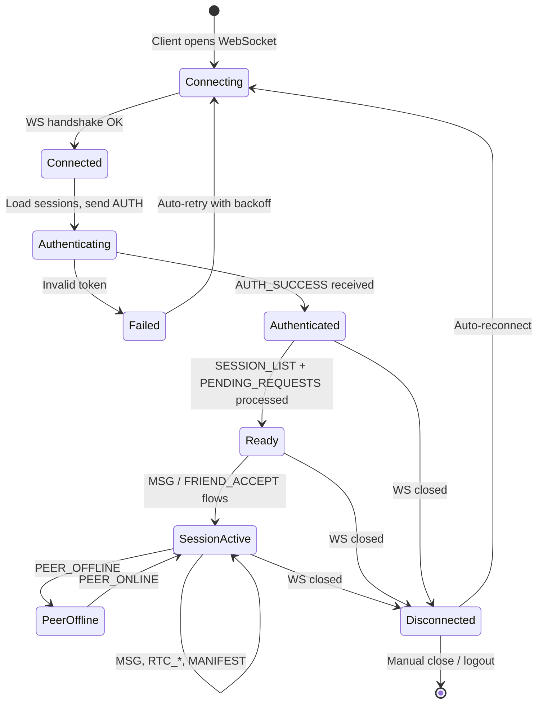

# WebSocket Protocol Specification

This document defines the complete WebSocket protocol used for communication between clients and the relay server.

## Protocol Overview

- **Transport**: WebSocket (RFC 6455)
- **Encoding**: JSON
- **Encryption**: Payload-level AES-GCM (E2E), TLS for transport (production)
- **Frame Structure**: All messages follow a standardized outer frame format

## Outer Frame Structure

All WebSocket messages use this JSON structure:

```typescript
interface Frame {
  t: string;          // Frame type (e.g., "AUTH", "MSG", "FRIEND_REQUEST")
  sid?: string;       // Session ID (used for session-specific frames)
  c?: boolean;        // Confirmation flag: if true, server sends DELIVERED or DELIVERED_FAILED
  sh?: string;        // Sender hash (injected by server on relaying MSG frames)
  p?: number;         // Priority level (0 = high/sync, 1 = normal messages)
  targetPubKey?: string; // Used by server to route RTC frames to a specific device
  data?: any;         // Frame-specific payload
}
```

**Priority Field (`p`)**: Used by the client-side `WorkerManager` to process high-priority crypto operations (e.g., sync manifests with `p=0`) before lower-priority ones (e.g., bulk message decryption with `p=1`).

## Frame Types Reference Table

| Frame Type             | Direction           | Purpose                                       | Requires Auth | Requires SID |
| ---------------------- | ------------------- | --------------------------------------------- | ------------- | ------------ |
| `AUTH`                 | Client → Server     | Authenticate with token + device public key   | No            | No           |
| `AUTH_SUCCESS`         | Server → Client     | Confirm authentication + issue session token  | N/A           | No           |
| `FRIEND_REQUEST`       | Bidirectional       | Encrypted friend request with profile payloads | Yes           | No           |
| `REQUEST_SENT`         | Server → Client     | Confirm request was received and queued       | N/A           | No           |
| `FRIEND_ACCEPT`        | Client → Server     | Accept friend request                         | Yes           | No           |
| `FRIEND_ACCEPTED`      | Server → Client     | Peer accepted your request                    | N/A           | No           |
| `FRIEND_ACCEPTED_ACK`  | Server → Client     | Confirm that you successfully accepted        | N/A           | No           |
| `FRIEND_DENY`          | Client → Server     | Deny friend request                           | Yes           | No           |
| `FRIEND_DENIED`        | Server → Client     | Peer denied your request                      | N/A           | No           |
| `BLOCK_USER`           | Client → Server     | Block a user                                  | Yes           | No           |
| `USER_BLOCKED`         | Server → Client     | Block acknowledged by server                  | N/A           | No           |
| `USER_BLOCKED_EVENT`   | Server → Client     | Peer blocked you                              | N/A           | No           |
| `UNFRIEND`             | Client → Server     | Remove a connection                           | Yes           | No           |
| `UNFRIENDED`           | Server → Client     | Peer removed you as connection                | N/A           | No           |
| `PENDING_REQUESTS`     | Server → Client     | Deliver stored offline friend requests        | N/A           | No           |
| `GET_DEVICES`          | Client → Server     | Fetch all registered devices for the account  | Yes           | No           |
| `DEVICE_LIST`          | Server → Client     | List of registered devices                    | N/A           | No           |
| `UPDATE_PUBKEY`        | Client → Server     | Register/update active device public key      | Yes           | No           |
| `GET_PUBLIC_KEY`       | Client → Server     | Look up public key(s) by target email         | Yes           | No           |
| `PUBLIC_KEY`           | Server → Client     | Respond with peer's public key(s)             | N/A           | No           |
| `DELETE_ACCOUNT`       | Client → Server     | Delete account and wipe server memory         | Yes           | No           |
| `DELETE_ACCOUNT_SUCCESS` | Server → Client   | Confirm account deletion                      | N/A           | No           |
| `DEVICE_NUCLEAR_SUCCESS` | Server → Client   | Confirm device wipe succeeded                 | N/A           | No           |
| `SESSION_LIST`         | Server → Client     | All active sessions pushed after AUTH_SUCCESS  | N/A           | No           |
| `MSG`                  | Bidirectional       | Encrypted message or inner command            | Yes           | Yes          |
| `RTC_OFFER`            | Bidirectional       | WebRTC SDP Offer (relayed, opaque blob)       | Yes           | Yes          |
| `RTC_ANSWER`           | Bidirectional       | WebRTC SDP Answer (relayed, opaque blob)      | Yes           | Yes          |
| `RTC_ICE`              | Bidirectional       | WebRTC ICE Candidate (relayed, opaque blob)   | Yes           | Yes          |
| `GET_TURN_CREDS`       | Client → Server     | Request ephemeral TURN credentials            | Yes           | No           |
| `TURN_CREDS`           | Server → Client     | Return TURN server credentials                | N/A           | No           |
| `PEER_ONLINE`          | Server → Client     | Peer came online in this session              | N/A           | Yes          |
| `PEER_OFFLINE`         | Server → Client     | Peer disconnected in this session             | N/A           | Yes          |
| `PROFILE_UPDATE`       | Server → Client     | Peer sent a profile change notification       | N/A           | Yes          |
| `SYNC_ACCEPT`          | Server → Client     | Own device accepted a friend request          | N/A           | No           |
| `SYNC_DENY`            | Server → Client     | Own device denied a friend request            | N/A           | No           |
| `SYNC_UNFRIEND`        | Server → Client     | Own device removed a connection               | N/A           | No           |
| `SYNC_BLOCK`           | Server → Client     | Own device blocked a user                     | N/A           | No           |
| `INVITE_CODE`          | Server → Client     | Server-generated invite code                  | N/A           | No           |
| `DELIVERED`            | Server → Client     | Message delivery confirmed                    | N/A           | Yes          |
| `DELIVERED_FAILED`     | Server → Client     | Message delivery failed (no online peers)     | N/A           | Yes          |
| `ERROR`                | Server → Client     | Error notification                            | N/A           | No           |
| `PING`                 | Server → Client     | Heartbeat to keep connection alive            | N/A           | No           |

---

## Frame Type Specifications

### 1. Authentication Frames

#### `AUTH` (Client → Server)

**Purpose**: Authenticate with the relay server using Google ID token or HMAC session token, and register the device's public key.

**Request**:

```json
{
  "t": "AUTH",
  "data": {
    "token": "eyJhbGciOiJSUzI1NiIsImtpZCI6Ij...",
    "publicKey": "YjY3ZDlmOWUyZmQ0..."
  }
}
```

**Server Logic**:

1. Determine token type: `sess:` prefix → HMAC session token; otherwise → Google ID token
2. Validate token (HMAC for session tokens, Google's `tokeninfo` API for ID tokens)
3. Extract and verify email
4. Register client with their public key (for multi-device routing)
5. If valid, respond with `AUTH_SUCCESS`, then immediately push `SESSION_LIST` and `PENDING_REQUESTS`

#### `AUTH_SUCCESS` (Server → Client)

**Purpose**: Confirm successful authentication and provide a refreshed session token.

**Response**:

```json
{
  "t": "AUTH_SUCCESS",
  "data": {
    "email": "user@example.com",
    "token": "sess:1735689600:user@example.com:a3d5f7e9..."
  }
}
```

**Client Action**:
- Save new session token to `SafeStorage`
- Emit `auth_success` event
- Server will immediately follow with `SESSION_LIST` and `PENDING_REQUESTS`

---

### 2. Connection Establishment Frames

#### `FRIEND_REQUEST` (Client → Server → Target Client)

**Purpose**: Request to connect with another user. The profile info is encrypted separately per target device key, so no device can decrypt another device's payload.

**Client → Server**:

```json
{
  "t": "FRIEND_REQUEST",
  "data": {
    "targetEmail": "peer@example.com",
    "payloads": [
      { "publicKey": "device1_pubkey_b64", "encryptedPacket": "ivb64.cipherb64" },
      { "publicKey": "device2_pubkey_b64", "encryptedPacket": "ivb64.cipherb64" }
    ]
  }
}
```

**Encrypted Packet Content** (after decryption):

```json
{
  "email": "requester@example.com",
  "name": "Display Name",
  "avatar": "data:image/png;base64,...",
  "nameVersion": 1,
  "avatarVersion": 1,
  "timestamp": 1704067200000
}
```

**Server → Target Client** (when target is online):

```json
{
  "t": "FRIEND_REQUEST",
  "data": {
    "senderHash": "sha256_of_sender_email",
    "payloads": [{ "publicKey": "...", "encryptedPacket": "..." }],
    "publicKeys": ["device1_pub", "device2_pub"]
  }
}
```

#### `FRIEND_ACCEPT` (Client → Server → Requester)

**Purpose**: Accept incoming connection and complete the key exchange.

**Request**:

```json
{
  "t": "FRIEND_ACCEPT",
  "data": {
    "targetEmail": "requester@example.com",
    "payloads": [
      { "publicKey": "requester_device1_pub", "encryptedPacket": "ivb64.cipherb64" }
    ]
  }
}
```

**Server Logic**:
1. Insert friend record into `friends` table with the deterministic SID
2. Remove from `pending_requests` table
3. Relay as `FRIEND_ACCEPTED` to all online devices of the requester
4. Send `FRIEND_ACCEPTED_ACK` to acceptor

#### `FRIEND_DENY` (Client → Server)

**Request**:

```json
{
  "t": "FRIEND_DENY",
  "data": { "targetEmail": "requester@example.com" }
}
```

**Or by hash (when email is unknown)**:

```json
{
  "t": "FRIEND_DENY",
  "data": { "targetHash": "sha256_of_email" }
}
```

**Server**: Deletes the stored request and forwards `FRIEND_DENIED` (with `reason` if applicable) to the requester's online devices, or queues for offline delivery.

#### `BLOCK_USER` (Client → Server)

**Purpose**: Notify the server to alert the target user they've been blocked. The server does not modify the friends relationship; the client manages its own `blocked_users` table.

```json
{
  "t": "BLOCK_USER",
  "data": { "targetEmail": "target@example.com" }
}
```

**Or by hash**:

```json
{
  "t": "BLOCK_USER",
  "data": { "targetHash": "sha256_of_email" }
}
```

**Server**: Emits `USER_BLOCKED_EVENT` to the target (queued if offline). Acknowledges with `USER_BLOCKED` to the initiator.

> [!NOTE]
> **Unblocking is local-only** — no `UNBLOCK_USER` frame exists. The unblock is propagated to the user's own linked devices via the `MANIFEST` frame's `blocks` section with `action: "unblock"`.

#### `UNFRIEND` (Client → Server)

**Purpose**: Remove a peer connection on the server.

```json
{
  "t": "UNFRIEND",
  "data": { "targetHash": "sha256_of_peer_email" }
}
```

**Server**: Removes the friend record; relays `UNFRIENDED { senderHash }` to the peer's online devices. Also sends `SYNC_UNFRIEND` to the initiator's other linked devices.

---

### 3. Session & Sync Management Frames

#### `SESSION_LIST` (Server → Client)

**Purpose**: Snapshot of all active sessions and peer presence pushed immediately after `AUTH_SUCCESS`.

```json
{
  "t": "SESSION_LIST",
  "data": [
    {
      "sid": "sha256_hash",
      "online": true,
      "peerHash": "sha256_of_peer_email",
      "peerPubKeys": ["device1_pub_b64", "device2_pub_b64"],
      "ownPubKeys": ["my_other_device_pub_b64"]
    }
  ]
}
```

**Client Action**: `SessionService.handleSessionList(data)`:
- Updates in-memory `online` and `isConnected` flags for all sessions
- Detects key changes and re-derives session keys if peer's public keys differ from stored
- Reconstructs sessions that exist server-side but not locally (e.g. after a restore or reinstall)

#### `PEER_ONLINE` (Server → Client)

```json
{
  "t": "PEER_ONLINE",
  "sid": "session_id",
  "data": { "peerPubKeys": ["..."] }
}
```

**Client Action**:
- Update presence to online
- If `peerPubKeys` changed, re-derive session keys
- Trigger `broadcastManifestToOwnDevices()` + `sendManifestToPeer(sid)`
- Retry pending messages

#### `PEER_OFFLINE` (Server → Client)

```json
{
  "t": "PEER_OFFLINE",
  "sid": "session_id",
  "data": { "peerPubKeys": ["still_online_device_pub"] }
}
```

**Client Action**: If `peerPubKeys` is non-empty, the peer still has other devices online — keep status online. If empty, mark offline.

#### Own-Device Sync Frames (Server → Client)

| Frame | Description | Client Action |
|-------|-------------|---------------|
| `SYNC_ACCEPT` | Another owned device accepted a friend request | `finalizeSession`, emit `pending_requests_changed` |
| `SYNC_DENY` | Another owned device denied a request | Delete from local `pending_requests` |
| `SYNC_UNFRIEND` | Another owned device unfriended someone | `removeConnection` locally |
| `SYNC_BLOCK` | Another owned device blocked someone | Insert into local `blocked_users` |

---

### 4. Messaging Frames

#### `MSG` (Bidirectional)

**Purpose**: Carrier frame for all encrypted application-level communication.

**Client → Server (multi-device)**:

```json
{
  "t": "MSG",
  "sid": "session_id",
  "c": true,
  "p": 1,
  "data": {
    "payloads": {
      "device1_pub_b64": "iv+ciphertext_base64",
      "device2_pub_b64": "iv+ciphertext_base64"
    }
  }
}
```

**Server Action**: Routes each payload blob to the matching connected device by its `publicKey` in the `payloads` map.

**Server → Client** (after routing):

```json
{
  "t": "MSG",
  "sid": "session_id",
  "sh": "sha256_of_sender_email",
  "data": {
    "payload": "iv+ciphertext_base64"
  }
}
```

The server injects `sh` (sender hash) and provides only the specific payload for that device.

**Inner Message Types** (after AES-GCM decryption):

```typescript
// Text message
{ "t": "MSG", "data": { "text": "Hello!", "id": "uuid", "timestamp": 1704067200000, "replyTo": null } }

// Edit message
{ "t": "EDIT", "data": { "id": "uuid", "text": "Edited hello!", "timestamp": 1704067200000 } }

// Delete message
{ "t": "DELETE", "data": { "id": "uuid", "timestamp": 1704067200000 } }

// Message reaction
{ "t": "REACTION", "data": { "messageId": "uuid", "emoji": "👍", "action": "add" | "remove" } }

// File metadata
{ "t": "FILE_INFO", "data": { "name": "photo.jpg", "size": 2048576, "type": "image/jpeg", "thumbnail": "data:...", "messageId": "uuid" } }

// File chunk request
{ "t": "FILE_REQ_CHUNK", "data": { "messageId": "uuid", "chunkIndex": 0 } }

// File chunk data
{ "t": "FILE_CHUNK", "data": { "messageId": "uuid", "chunkIndex": 0, "payload": "base64_data", "isLast": false } }

// Call signaling
{ "t": "CALL_START", "data": { "type": "Audio" | "Video" } }
{ "t": "CALL_ACCEPT" }
{ "t": "CALL_END" }
{ "t": "CALL_BUSY" }

// Profile sync
{ "t": "PROFILE_VERSION", "data": { "name_version": 2, "avatar_version": 1 } }
{ "t": "GET_PROFILE" }
{ "t": "PROFILE_DATA", "data": { "name": "...", "avatar": "data:...", "name_version": 2, "avatar_version": 1 } }

// Cross-device state sync
{ "t": "MANIFEST", "manifest": { "blocks": [...], "requests": [...], "aliases": [...], "profile": {...}, "messages": [...] } }

// Cross-device call awareness
{ "t": "SYNC_CALL_ACCEPT", "data": { "callSid": "..." } }
{ "t": "SYNC_CALL_END", "data": { "callSid": "..." } }
```

#### `DELIVERED` / `DELIVERED_FAILED` (Server → Client)

```json
{ "t": "DELIVERED", "sid": "session_id" }
{ "t": "DELIVERED_FAILED", "sid": "session_id" }
```

- **DELIVERED**: Server successfully forwarded the frame to at least one peer device. Client updates `messages.status = 2`.
- **DELIVERED_FAILED**: No peer devices were online. Client keeps `status = 1` (pending) and retries on `PEER_ONLINE`.

---

### 5. WebRTC Signaling Frames

These three frames carry encrypted SDP/ICE data for WebRTC call establishment. The relay server relays them opaquely — it cannot read the SDP.

#### `RTC_OFFER` (Bidirectional)

```json
{
  "t": "RTC_OFFER",
  "sid": "session_id",
  "data": { "payload": "aes_gcm_encrypted_sdp_offer_json" }
}
```

#### `RTC_ANSWER` (Bidirectional)

```json
{
  "t": "RTC_ANSWER",
  "sid": "session_id",
  "data": { "payload": "aes_gcm_encrypted_sdp_answer_json" }
}
```

#### `RTC_ICE` (Bidirectional)

```json
{
  "t": "RTC_ICE",
  "sid": "session_id",
  "data": { "payload": "aes_gcm_encrypted_ice_candidate_json" }
}
```

#### `GET_TURN_CREDS` / `TURN_CREDS`

```json
{ "t": "GET_TURN_CREDS" }
```

```json
{
  "t": "TURN_CREDS",
  "data": {
    "urls": ["turn:turn.example.com:3478?transport=udp"],
    "username": "1704999999:user",
    "credential": "base64_hmac_password",
    "ttl": 600
  }
}
```

---

### 6. Device Management Frames

#### `GET_DEVICES` / `DEVICE_LIST`

```json
{ "t": "GET_DEVICES" }
```

```json
{
  "t": "DEVICE_LIST",
  "data": [
    { "publicKey": "...", "lastSeen": 1704067200000 }
  ]
}
```

#### `UPDATE_PUBKEY`

**Purpose**: Update the device's public key on the server (e.g., after an app reinstall that generated a new identity key).

```json
{
  "t": "UPDATE_PUBKEY",
  "data": { "publicKey": "new_pub_b64" }
}
```

---

### 7. Error & Control Frames

#### `ERROR` (Server → Client)

```json
{
  "t": "ERROR",
  "data": { "message": "Authentication required" }
}
```

**Common Error Messages**:

| Message | Meaning | Client Action |
|---------|---------|---------------|
| `"Auth failed"` | Invalid or expired token | `logout()` |
| `"Authentication required"` | Used protected endpoint without auth | `logout()` |
| `"User not online"` | Target user not connected | Show notification |
| `"User not found"` | Target user has no public key registered | Emit `request_failed` |
| `"User blocked"` | Target user blocked the sender | Emit `request_failed` |
| `"Rate limit exceeded"` | Too many messages sent | Emit `rate_limit_exceeded` |
| `"Already logged in on another device"` | Email already connected (no multi-device support on this deployment) | `logout()` |

#### `PING` (Server → Client)

```json
{ "t": "PING" }
```

Sent every ~30 seconds. No client action required.

---

## Connection Lifecycle


```mermaid
stateDiagram-v2
    [*] --> Connecting: Client opens WebSocket
    Connecting --> Connected: WS handshake OK
    Connected --> Authenticating: Load sessions, send AUTH
    Authenticating --> Failed: Invalid token
    Authenticating --> Authenticated: AUTH_SUCCESS received

    Failed --> Connecting: Auto-retry with backoff

    Authenticated --> Ready: SESSION_LIST + PENDING_REQUESTS processed
    Ready --> SessionActive: MSG / FRIEND_ACCEPT flows

    SessionActive --> SessionActive: MSG, RTC_*, MANIFEST
    SessionActive --> PeerOffline: PEER_OFFLINE
    PeerOffline --> SessionActive: PEER_ONLINE

    SessionActive --> Disconnected: WS closed
    Ready --> Disconnected: WS closed
    Authenticated --> Disconnected: WS closed

    Disconnected --> Connecting: Auto-reconnect
    Disconnected --> [*]: Manual close / logout
```

---

## Rate Limiting

| Frame Type | Limit | Burst Behavior |
|------------|-------|----------------|
| `MSG` | 100 frames/second per client | Excess dropped; `ERROR { "Rate limit exceeded" }` sent |
| `FRIEND_REQUEST` | 1 per 5 seconds per client | Rejected with error |
| `AUTH` | 3 attempts/minute per IP | Temporary IP block (1 minute) |

## Message Delivery Guarantees

- **At-most-once delivery**: The server relays each `MSG` frame exactly once to online peers
- **No server persistence**: Messages are never stored on the server
- **Client-side queuing**: Clients queue `status=1` messages locally and re-send via `syncPendingMessages()` when the peer comes back online
- **MANIFEST sync**: Covers missed messages during offline periods via `sendManifestToPeer()`
